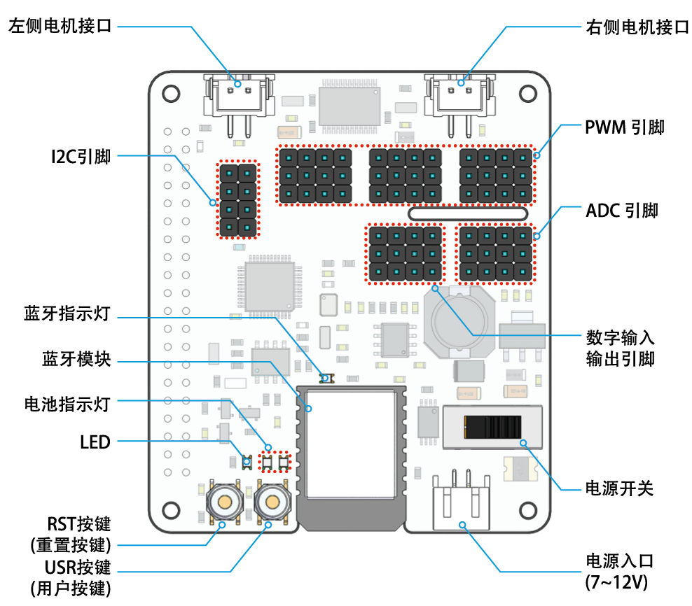

关于 Robot HAT
-----------------------------

**RST 按钮**
    * 短按 RST 按钮将导致所有正在运行的程序重置。
    * 长按 RST 按钮直到 LED 亮起，然后松开将断开 Robot HAT 的蓝牙芯片。

**USR 按钮**
    * USR 按钮的功能可通过编程进行配置。 （按下导致输入 ``0`` ，松开产生 ``1`` 输入）

**LED**
    * 通过编程配置（输出 ``1`` 打开LED，输出 ``0`` 关闭LED。）

**电池指示灯**
    * 电池电压高于 7.8V 将点亮两个 LED 指示灯。电池电压在 6.7V 到 7.8V 之间只会点亮一个 LED，低于 6.7V 的电压将关闭两个 LED。

**蓝牙指示灯**
    * 蓝牙指示灯 LED 将在蓝牙连接稳定时保持亮起，并在信号传输期间快速闪烁。如果蓝牙断开连接，LED 将每隔 1 秒闪烁一次。