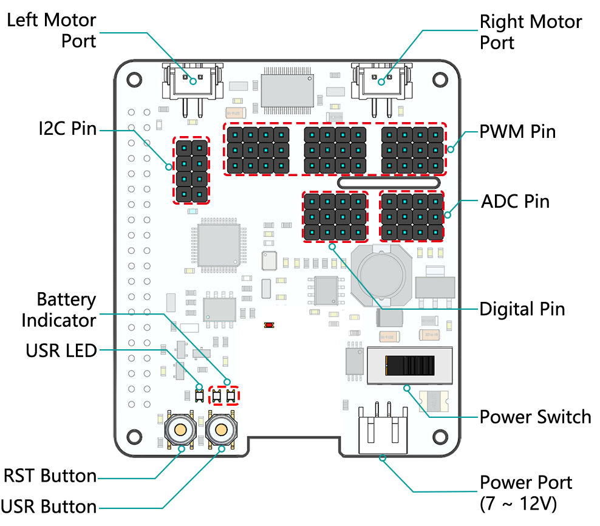

.. note::

    Hello, welcome to the SunFounder Raspberry Pi & Arduino & ESP32 Enthusiasts Community on Facebook! Dive deeper into Raspberry Pi, Arduino, and ESP32 with fellow enthusiasts.

    **Why Join?**

    - **Expert Support**: Solve post-sale issues and technical challenges with help from our community and team.
    - **Learn & Share**: Exchange tips and tutorials to enhance your skills.
    - **Exclusive Previews**: Get early access to new product announcements and sneak peeks.
    - **Special Discounts**: Enjoy exclusive discounts on our newest products.
    - **Festive Promotions and Giveaways**: Take part in giveaways and holiday promotions.

    👉 Ready to explore and create with us? Click [|link_sf_facebook|] and join today!

About Robot HAT
========================

**Left/Right Motor Port**
    * 2-channel XH2.54 motor ports.
    * The left port is connected to GPIO 4 and the right port is connected to GPIO 5.

**I2C Pin**
    * 2-channel I2C pins from Raspberry Pi.

**PWM Pin**
    * 12-channel PWM pins, P0-P12.

**ADC Pin**
    * 4-channel ADC pins, A0-A3.

**Digital Pin**
    * 4-channel digital pins, D0-D3.

**Battery Indicator**
    * Two LEDs light up when the voltage is higher than 7.8V.
    * One LED lights up in the 6.7V to 7.8V range. 
    * Below 6.7V, both LEDs turn off.

**USR LED**
    * Set by your program. (Outputting 1 turns the LED on; Outputting 0 turns it off.)

**RST Button**
    * Short pressing RST Button causes program resetting.
    * Long press RST Button till the LED lights up then release, and you will disconnect the Bluetooth.

**USR Button**
    * The functions of USR Button can be set by your programming. (Pressing down leads to a input “0”; releasing produces a input “1”. ) 

**Power Switch**
    * Turn on/off the power of the robot HAT.
    * When you connect power to the power port, the Raspberry Pi will boot up. However, you will need to switch the power switch to ON to enable Robot HAT.

**Power Port**
    * 7-12V PH2.0 2pin power input.
    * Powering the Raspberry Pi and Robot HAT at the same time.

.. note::
    You can see more details in the `Robot HAT Documentation <https://robot-hat.readthedocs.io/en/latest/index.html>`_.