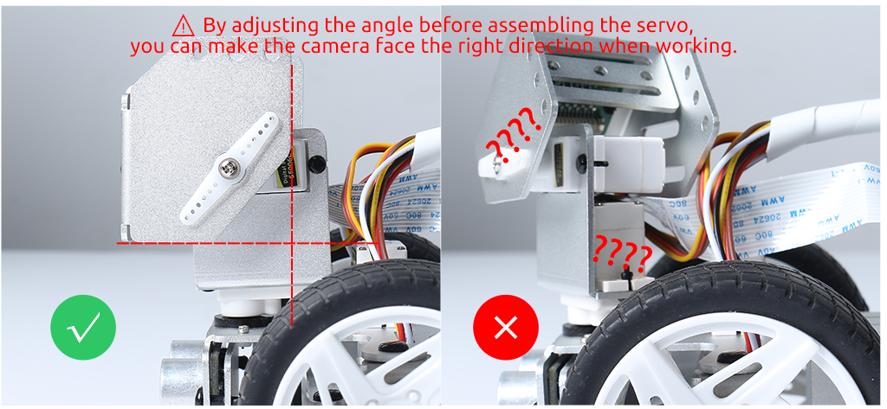

.. note::

    Hallo und willkommen in der SunFounder Raspberry Pi & Arduino & ESP32 Enthusiasten-Gemeinschaft auf Facebook! Tauchen Sie tiefer ein in die Welt von Raspberry Pi, Arduino und ESP32 mit anderen Enthusiasten.

    **Warum beitreten?**

    - **Expertenunterstützung**: Lösen Sie Nachverkaufsprobleme und technische Herausforderungen mit Hilfe unserer Gemeinschaft und unseres Teams.
    - **Lernen & Teilen**: Tauschen Sie Tipps und Anleitungen aus, um Ihre Fähigkeiten zu verbessern.
    - **Exklusive Vorschauen**: Erhalten Sie frühzeitigen Zugang zu neuen Produktankündigungen und exklusiven Einblicken.
    - **Spezialrabatte**: Genießen Sie exklusive Rabatte auf unsere neuesten Produkte.
    - **Festliche Aktionen und Gewinnspiele**: Nehmen Sie an Gewinnspielen und Feiertagsaktionen teil.

    👉 Sind Sie bereit, mit uns zu erkunden und zu erschaffen? Klicken Sie auf [|link_sf_facebook|] und treten Sie heute bei!

Servo für die Montage einstellen
=======================================================

Vor der Montage des Servos 
muss der Winkel auf null Grad eingestellt werden. 
Dies liegt daran, dass der Servomotor einen begrenzten Bewegungsumfang hat. 
Indem man den Winkel auf null Grad einstellt, stellt man sicher, dass der Servo in seiner 
Ausgangsposition ist und seinen Bewegungsbereich nicht überschreitet, wenn er eingeschaltet wird. 
Wenn der Servo vor der Montage nicht auf null Grad eingestellt ist, 
könnte er versuchen, seinen Bewegungsbereich zu überschreiten, wenn er eingeschaltet wird, 
was den Servo oder das mechanische System, an das er angeschlossen ist, beschädigen könnte. 
Daher ist es wichtig, den Winkel auf null Grad einzustellen, um einen 
sicheren und normalen Betrieb des Servomotors zu gewährleisten.

**Für Python-Nutzer**

Bitte beziehen Sie sich auf :ref:`quick_guide_python`, um die 
Installation des Raspberry Pi OS abzuschließen und den Winkel der Servos anzupassen.

**Für Ezblock-Nutzer**

.. note::

  Wenn Sie einen Raspberry Pi 5 verwenden, können Sie unsere grafische Programmier-Software EzBlock nicht verwenden, um den PiCar-X zu programmieren.

Nachdem Sie das Ezblock-System installiert haben, 
kann der P11-Pin verwendet werden, um den Servo anzupassen. 
Weitere Informationen finden Sie unter :ref:`ezb_servo_adjust`.
