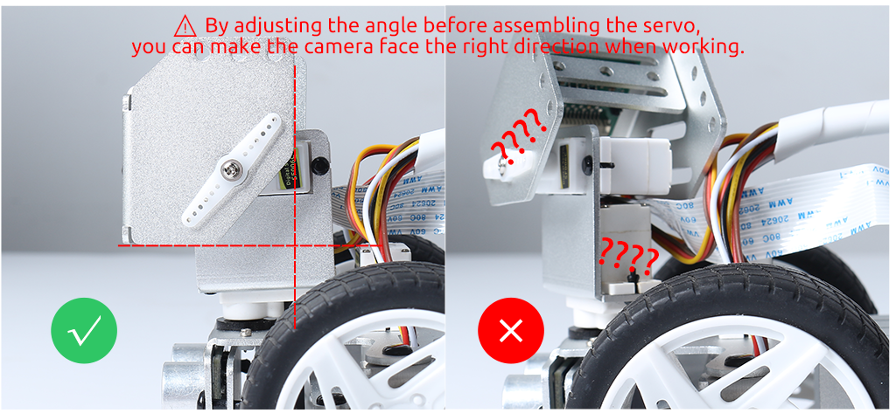

.. note::

    ¡Hola! Bienvenido a la comunidad de entusiastas de SunFounder Raspberry Pi, Arduino y ESP32 en Facebook. ¡Profundiza en el mundo de Raspberry Pi, Arduino y ESP32 junto a otros entusiastas!

    **¿Por qué unirte?**

    - **Soporte experto**: Resuelve problemas postventa y desafíos técnicos con la ayuda de nuestra comunidad y equipo.
    - **Aprende y comparte**: Intercambia consejos y tutoriales para mejorar tus habilidades.
    - **Preestrenos exclusivos**: Obtén acceso anticipado a nuevos anuncios de productos y adelantos.
    - **Descuentos especiales**: Disfruta de descuentos exclusivos en nuestros productos más recientes.
    - **Promociones festivas y sorteos**: Participa en sorteos y promociones especiales.

    👉 ¿Listo para explorar y crear con nosotros? Haz clic en [|link_sf_facebook|] y únete hoy mismo.

Ajuste del Servo para el Ensamblaje
====================================

Antes de ensamblar el servo, es necesario ajustar el ángulo a cero.
Esto se debe a que el motor del servo tiene un rango de movimiento limitado,
y al establecer el ángulo en cero grados, se asegura que el servo esté en su
posición inicial y no exceda su rango de movimiento cuando se encienda.
Si el servo no se ajusta a cero grados antes del ensamblaje,
puede intentar superar su rango de movimiento al encenderse,
lo que podría dañar el servo o el sistema mecánico al que está conectado.
Por lo tanto, ajustar el ángulo a cero es un paso importante para garantizar el
funcionamiento seguro y normal del motor del servo.

Para Usuarios de Python
------------------------

Por favor, consulta :ref:`quick_guide_python` para completar la
instalación del sistema operativo Raspberry Pi OS y ajustar el ángulo de los servos.

Para Usuarios de Ezblock
-------------------------

.. note::

    Si estás utilizando una Raspberry Pi 5, nuestro software de programación gráfica, EzBlock, no es compatible.

Después de haber instalado el sistema Ezblock,
se puede usar el pin P11 para ajustar el servo.
Consulta :ref:`ezb_servo_adjust` para más detalles.
