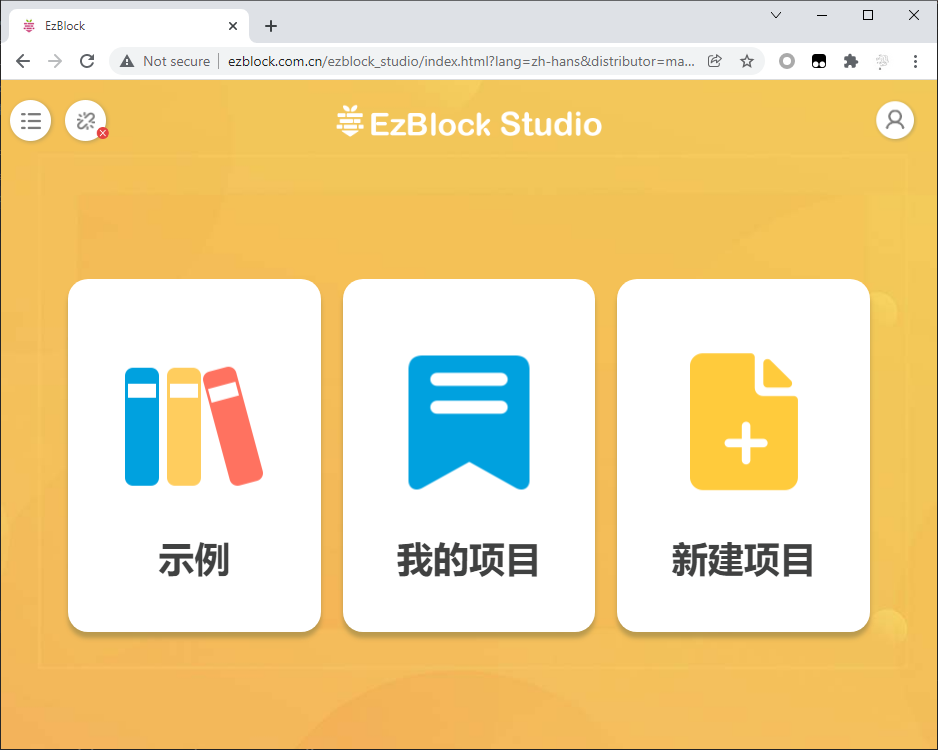

.. note::

    你好，欢迎来到 SunFounder 树莓派、Arduino 和 ESP32 爱好者社区的 Facebook 页面！与其他爱好者一起深入探讨树莓派、Arduino 和 ESP32。

    **为什么加入？**

    - **专家支持**: 通过我们的社区和团队的帮助解决售后问题和技术挑战。
    - **学习与分享**: 交流技巧和教程，提升你的技能。
    - **独家预览**: 提前了解新产品发布和预告。
    - **特别折扣**: 尊享我们最新产品的专属折扣。
    - **节日促销和赠品**: 参与赠品活动和节日促销。

    👉 准备好与我们一起探索和创造了吗？点击 [|link_sf_facebook|] 加入我们吧！

.. _web_ezblock:

网页版 EzBlock
===========================================

进入 `网页版 EzBlock <http://ezblock.com.cn/ezblock_studio/index.html?lang=zh-hans&distributor=mammoth>`_ 。

在首页点击左上角的产品按钮。

点击连接。

.. image:: img/sp211203_160318.png

输入IP地址。

.. image:: img/sp211203_160509.png

随后将弹出“连接成功”的提示，此时你可以回到 :ref:`play_ezblock` 。

.. image:: img/sp211203_160543.png