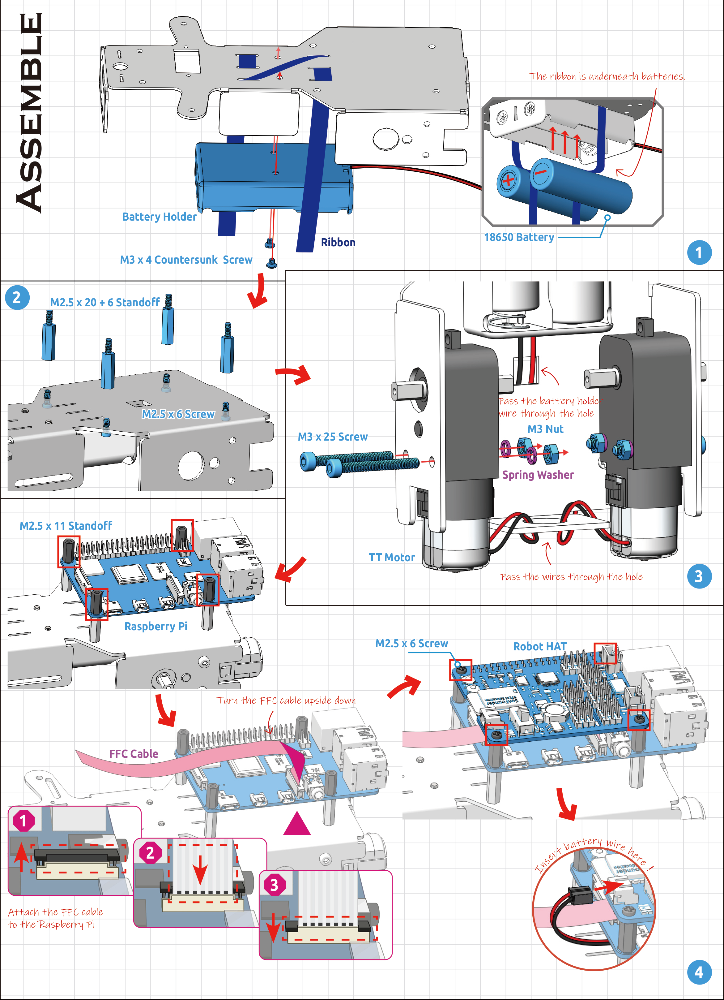
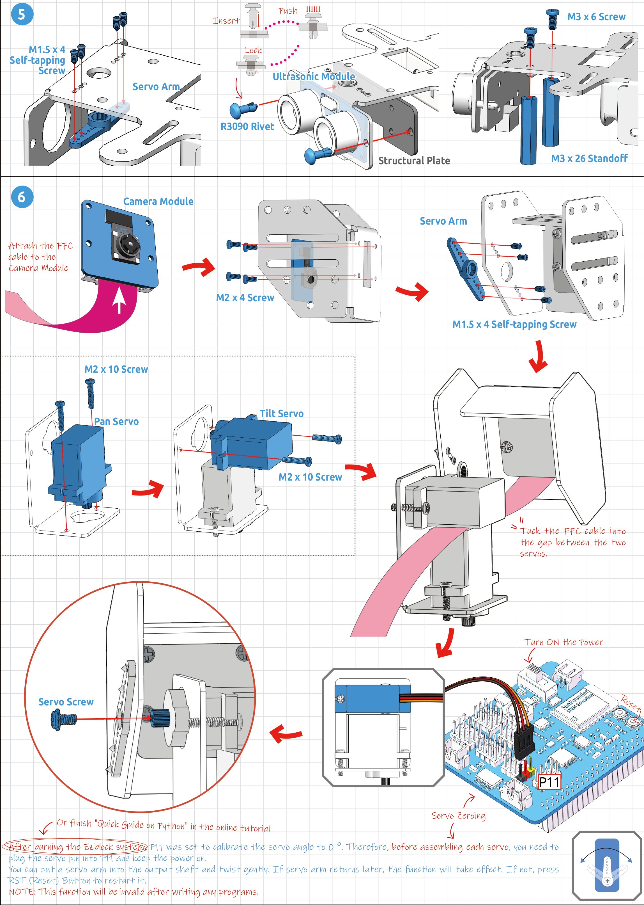
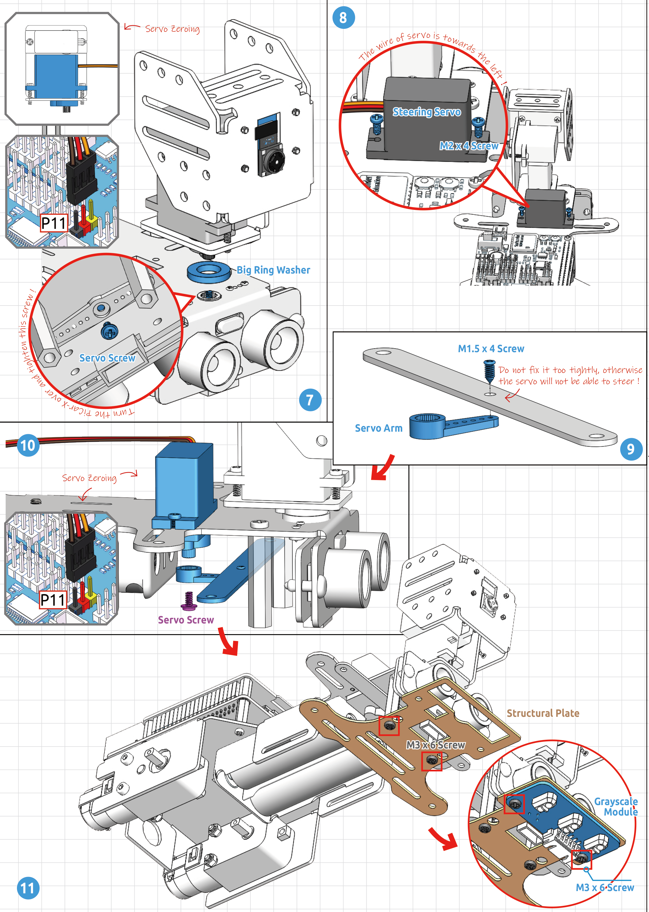
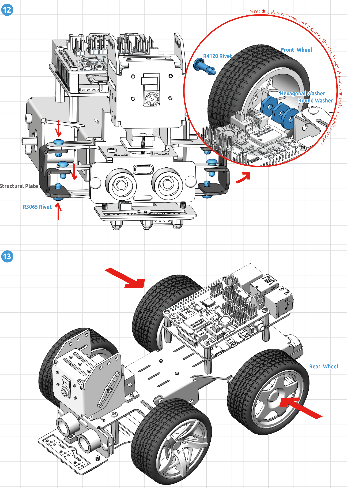
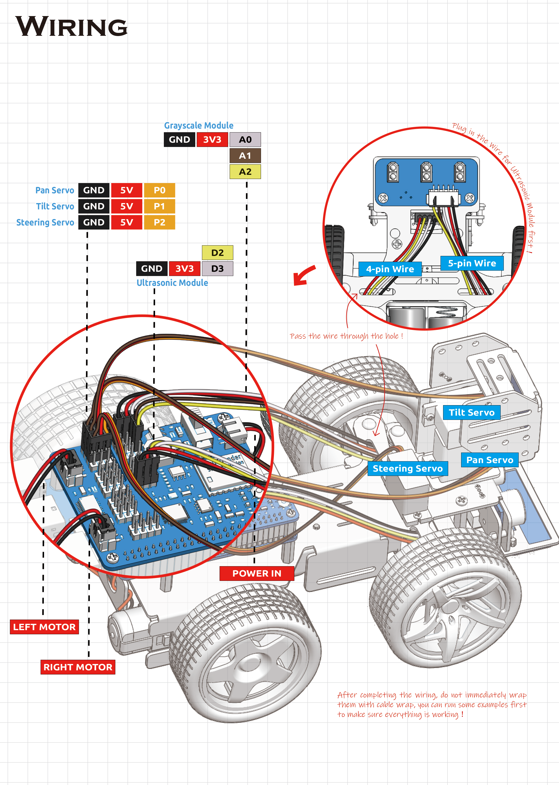

Building the PiCar-x
======================================

Now get familiar with these components in this package. In the following steps, there are so many details you need to notice especially in the operation of calibrating the servo angle. In addition, you ought to check whether your wiring conforms to the instruction of this manual.   

