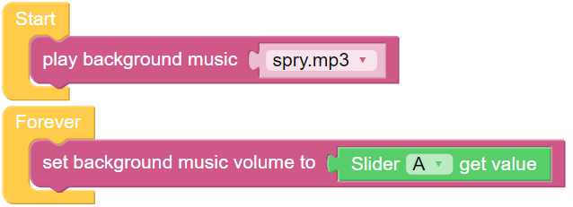

バックグラウンドミュージック
======================================================

PiCar-Xをプログラムして音効果やテキスト-音声(TTS)を再生するだけでなく、PiCar-Xはバックグラウンドミュージックも再生します。このプロジェクトでは、音楽の音量を調整するための **Slider** ウィジェットも使用します。

* :ref:`ezblock:remote_control_latest`

Ezblocksのリモートコントロール機能の詳細なチュートリアルは、:ref:`ezb_remote_control` チュートリアルを参照してください。

**TIPS**

**play background music** ブロックは **Start** 機能に追加する必要があります。ドロップダウンメニューを使用して、PiCar-Xが再生する異なるバックグラウンドミュージックを選択します。

**set background music volume to** ブロックは、0から100の範囲で音量を調整します。

**Remote Control** ページから **Slider** バーをドラッグして、音楽の音量を調整します。

**slider [A] get value** ブロックはスライダーの値を読み取ります。上の例では、スライダー 'A' が選択されています。複数のスライダーがある場合、ドロップダウンメニューを使用して適切なものを選択します。

**例**

.. note::

    * 以下の画像に従ってプログラムを書くことができます。チュートリアルを参照してください: :ref:`ezblock:create_project_latest`。
    * EzBlock Studioの **Examples** ページで同じ名前のコードを見つけ、 **Run** または **Edit** を直接クリックしてください。

