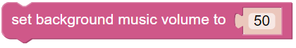
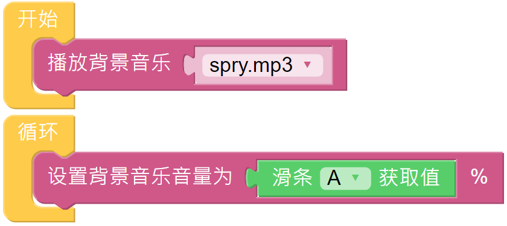

.. note::

    Hola, ¡bienvenido a la Comunidad de Entusiastas de SunFounder Raspberry Pi, Arduino y ESP32 en Facebook! Sumérgete en el mundo de Raspberry Pi, Arduino y ESP32 junto a otros entusiastas.

    **¿Por qué unirse?**

    - **Soporte experto**: Resuelve problemas postventa y desafíos técnicos con la ayuda de nuestra comunidad y equipo.
    - **Aprende y comparte**: Intercambia consejos y tutoriales para mejorar tus habilidades.
    - **Preestrenos exclusivos**: Obtén acceso anticipado a nuevos anuncios de productos y adelantos exclusivos.
    - **Descuentos especiales**: Disfruta de descuentos exclusivos en nuestros productos más recientes.
    - **Promociones festivas y sorteos**: Participa en sorteos y promociones durante las festividades.

    👉 ¿Listo para explorar y crear con nosotros? Haz clic en [|link_sf_facebook|] y únete hoy mismo!

Música de Fondo
===============

Además de programar el PiCar-X para reproducir efectos de sonido o texto a voz (TTS), el PiCar-X también reproducirá música de fondo. Este proyecto también utilizará un widget **Deslizador** para ajustar el volumen de la música.

* :ref:`ezblock:remote_control_latest`

Para obtener un tutorial detallado sobre las funciones de control remoto de Ezblocks, consulta el tutorial :ref:`ezb_remote_control`.

**CONSEJOS**

El bloque **reproducir música de fondo** debe añadirse a la función **Start**. Usa el menú desplegable para elegir la música de fondo que reproducirá el PiCar-X.

El bloque **ajustar volumen de música de fondo a** permitirá ajustar el volumen entre 0 y 100.

Arrastra una barra **Deslizador** desde la página de **Control Remoto** para ajustar el volumen de la música.

El bloque **deslizador [A] obtener valor** leerá el valor del deslizador. En el ejemplo anterior, se ha seleccionado el deslizador 'A'. Si hay varios deslizadores, usa el menú desplegable para seleccionar el adecuado.

**EJEMPLO**

.. note::

    * Puedes escribir el programa según la imagen a continuación, consulta el tutorial: :ref:`ezblock:create_project_latest`.
    * O encuentra el código con el mismo nombre en la página de **Ejemplos** de EzBlock Studio y haz clic en **Ejecutar** o **Editar** directamente.

