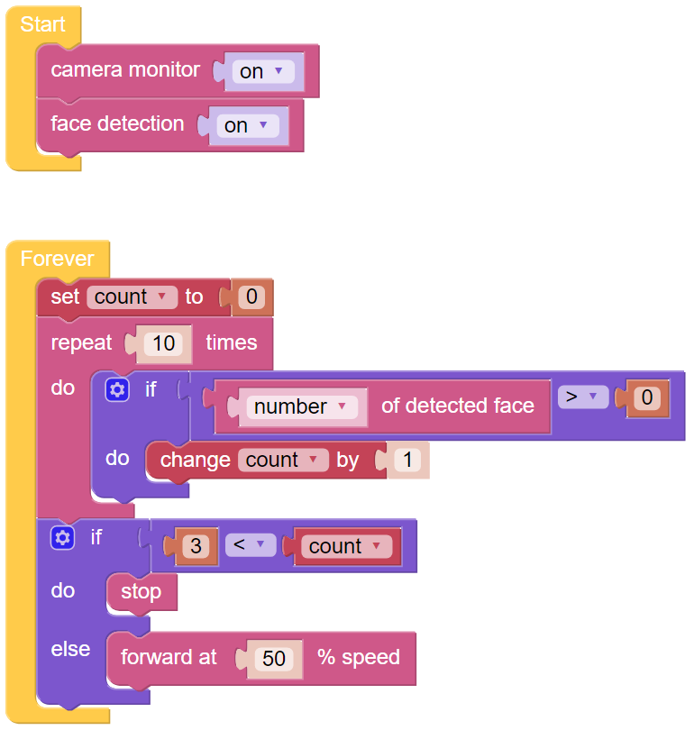

.. note::

    Hola, ¡bienvenido a la Comunidad de Entusiastas de SunFounder Raspberry Pi, Arduino y ESP32 en Facebook! Sumérgete en el mundo de Raspberry Pi, Arduino y ESP32 junto a otros entusiastas.

    **¿Por qué unirse?**

    - **Soporte experto**: Resuelve problemas postventa y desafíos técnicos con la ayuda de nuestra comunidad y equipo.
    - **Aprende y comparte**: Intercambia consejos y tutoriales para mejorar tus habilidades.
    - **Preestrenos exclusivos**: Obtén acceso anticipado a nuevos anuncios de productos y adelantos exclusivos.
    - **Descuentos especiales**: Disfruta de descuentos exclusivos en nuestros productos más recientes.
    - **Promociones festivas y sorteos**: Participa en sorteos y promociones durante las festividades.

    👉 ¿Listo para explorar y crear con nosotros? Haz clic en [|link_sf_facebook|] y únete hoy mismo!

Cuidado con los peatones
=============================

Este proyecto hará que el PiCar-X tome las medidas adecuadas según las condiciones de la carretera. Mientras conduce, el PiCar-X se detendrá por completo si detecta a un peatón en su camino.

Una vez que el programa esté en funcionamiento, sostén una foto de una persona frente al PiCar-X. El monitor de video detectará el rostro de la persona, y el PiCar-X se detendrá automáticamente.

Para simular los protocolos de seguridad vial, se crea un procedimiento de juicio que enviará un valor de **[count]** a un bloque **if do else**. El procedimiento de juicio buscará un rostro humano 10 veces, y si aparece un rostro, incrementará **[count]** en +1. Cuando **[count]** sea mayor que 3, el PiCar-X dejará de moverse.

* :ref:`ezblock:remote_control_latest`

.. image:: img/face_detection.PNG

**EJEMPLO**

.. note::

    * Puedes escribir el programa según la imagen a continuación, consulta el tutorial: :ref:`ezblock:create_project_latest`.
    * O encuentra el código con el mismo nombre en la página de **Ejemplos** de EzBlock Studio y haz clic en **Ejecutar** o **Editar** directamente.

