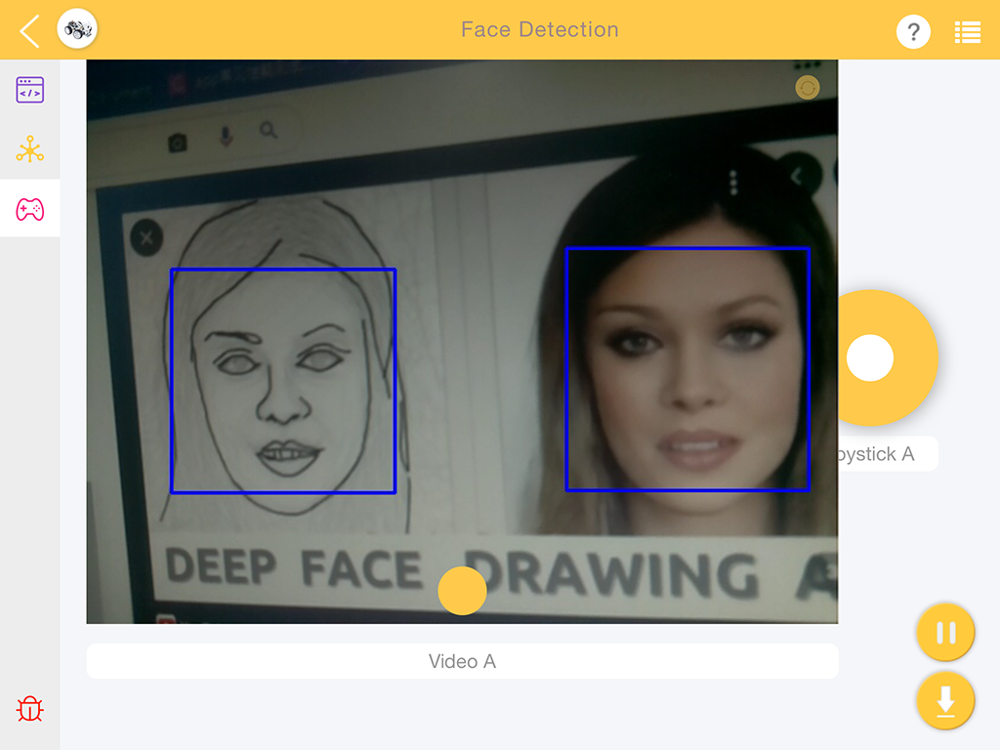
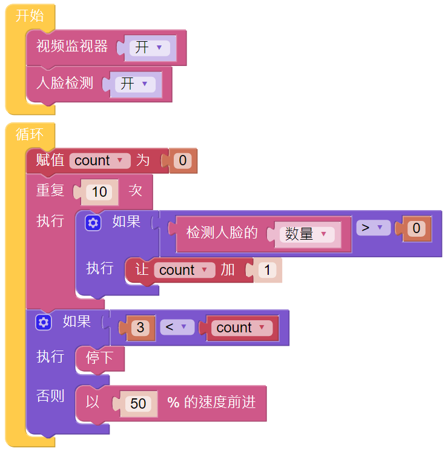

.. note::

    Hallo und willkommen in der SunFounder Raspberry Pi & Arduino & ESP32 Enthusiasten-Gemeinschaft auf Facebook! Tauchen Sie tiefer ein in die Welt von Raspberry Pi, Arduino und ESP32 mit anderen Enthusiasten.

    **Warum beitreten?**

    - **Expertenunterstützung**: Lösen Sie Nachverkaufsprobleme und technische Herausforderungen mit Hilfe unserer Gemeinschaft und unseres Teams.
    - **Lernen & Teilen**: Tauschen Sie Tipps und Anleitungen aus, um Ihre Fähigkeiten zu verbessern.
    - **Exklusive Vorschauen**: Erhalten Sie frühzeitigen Zugang zu neuen Produktankündigungen und exklusiven Einblicken.
    - **Spezialrabatte**: Genießen Sie exklusive Rabatte auf unsere neuesten Produkte.
    - **Festliche Aktionen und Gewinnspiele**: Nehmen Sie an Gewinnspielen und Feiertagsaktionen teil.

    👉 Sind Sie bereit, mit uns zu erkunden und zu erschaffen? Klicken Sie auf [|link_sf_facebook|] und treten Sie heute bei!

Achtung Fußgänger
=================

In diesem Projekt wird der PiCar-X entsprechende Maßnahmen basierend auf den Straßenverhältnissen durchführen. Während der Fahrt wird der PiCar-X anhalten, wenn ein Fußgänger auf seinem Weg erkannt wird.

Sobald das Programm läuft, halten Sie ein Foto einer Person vor den PiCar-X. Der Video-Monitor erkennt das Gesicht der Person, und der PiCar-X wird automatisch anhalten.

Um Fahrsicherheitsprotokolle zu simulieren, wird ein Beurteilungsverfahren erstellt, das einen **[Zähler]**-Wert an einen **if do else**-Block sendet. Das Beurteilungsverfahren sucht 10-mal nach einem menschlichen Gesicht, und wenn ein Gesicht erscheint, wird **[Zähler]** um +1 erhöht. Wenn **[Zähler]** größer als 3 ist, wird der PiCar-X anhalten.

* :ref:`ezblock:remote_control_latest`

**BEISPIEL**

.. note::

    * Sie können das Programm gemäß der folgenden Abbildung schreiben. Bitte beachten Sie das Tutorial: :ref:`ezblock:create_project_latest`.
    * Oder finden Sie den Code mit demselben Namen auf der **Examples**-Seite des EzBlock Studios und klicken Sie direkt auf **Run** oder **Edit**.

