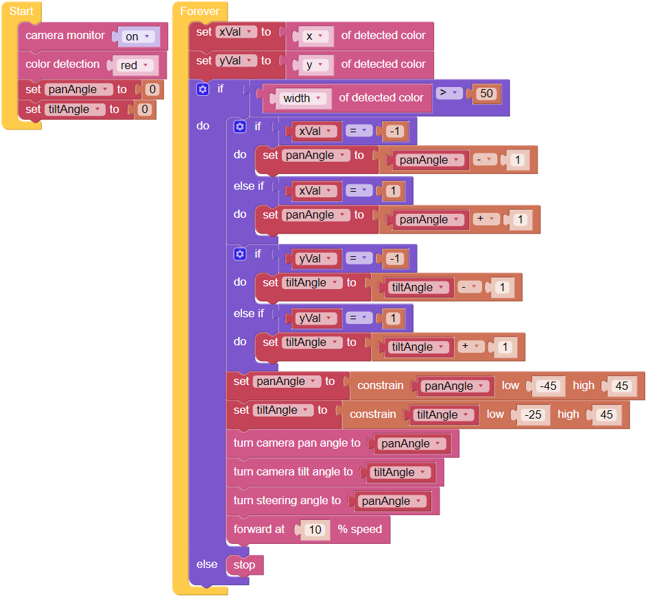

Bullfight
==============

Turn PiCar-X into an angry bull! Prepare a red cloth, such as a handkerchief, and become a Bullfighter. When the PiCar-X chases after the red cloth, be careful not to get hit! 

.. note::

    This project is more advanced than the preceding projects. The PiCar-X will need to use the color detection function to keep the camera facing towards the red cloth, then the body orientation will need to automatically adjust in response to the direction that the camera is facing.

**TIPS**

Begin with adding the **color detection [red]** block to the **Start** widget to make the PiCar-X look for a red-colored object. In the forever loop, add the **[width] of detected color** block to transform the input into an “object detection” grid. 

The “object detection” will output the detected coordinates in (x, y) values, 
based on the center point of the camera image. 
The screen is divided into a 3x3 grid, as shown below, 
so if the red cloth is kept in the top left of the cameras’ image, the (x, y) coordinates will be (-1, 1).

.. image:: img/sp210512_174956.png

The “object detection” will detect the Width and Height of the graphic. 
If multiple targets are identified, the dimensions of the largest target will be recorded.

**EXAMPLE**

.. note::

    * You can write the program according to the following picture, please refer to the tutorial: :ref:`ezblock:create_project_latest`.
    * Or find the code with the same name on the **Examples** page of the EzBlock Studio and click **Run** or **Edit** directly.

