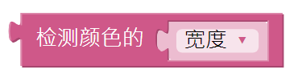
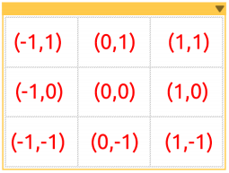
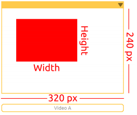
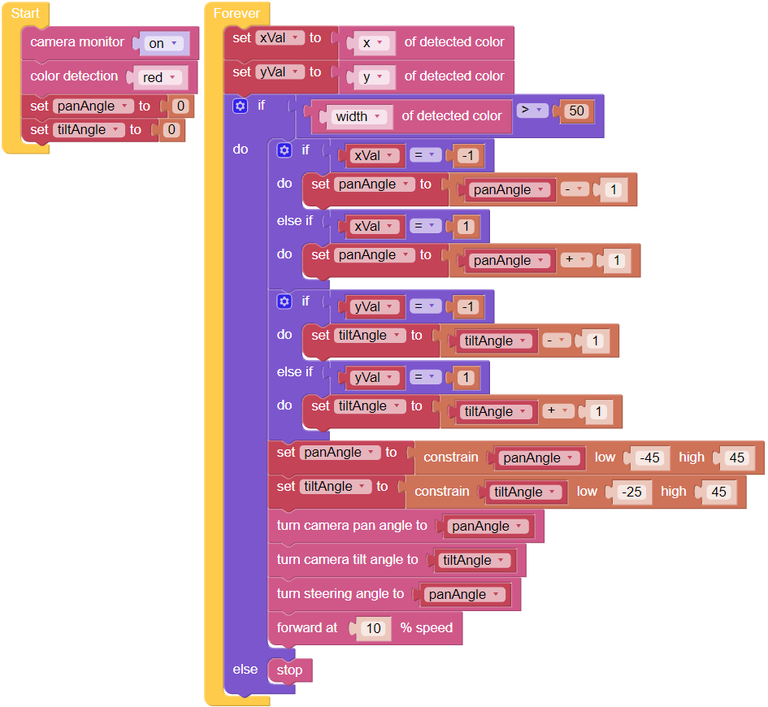

.. note::

    ¡Hola! Bienvenido a la comunidad de entusiastas de SunFounder Raspberry Pi, Arduino y ESP32 en Facebook. Sumérgete en el mundo de Raspberry Pi, Arduino y ESP32 junto a otros entusiastas.

    **¿Por qué unirse?**

    - **Soporte experto**: Resuelve problemas postventa y desafíos técnicos con la ayuda de nuestra comunidad y equipo.
    - **Aprende y comparte**: Intercambia consejos y tutoriales para mejorar tus habilidades.
    - **Preestrenos exclusivos**: Obtén acceso anticipado a nuevos anuncios de productos y adelantos exclusivos.
    - **Descuentos especiales**: Disfruta de descuentos exclusivos en nuestros productos más recientes.
    - **Promociones festivas y sorteos**: Participa en sorteos y promociones durante las festividades.

    👉 ¿Listo para explorar y crear con nosotros? Haz clic en [|link_sf_facebook|] y únete hoy mismo!

Corrida de toros
================

¡Convierte al PiCar-X en un toro furioso! Prepara un pañuelo rojo, como un trapo, y conviértete en un torero. Cuando el PiCar-X persiga el trapo rojo, ¡ten cuidado de no ser embestido!

.. note::

    Este proyecto es más avanzado que los anteriores. El PiCar-X deberá usar la función de detección de color para mantener la cámara enfocada hacia el trapo rojo, y luego el cuerpo deberá ajustar su orientación automáticamente en respuesta a la dirección en la que se oriente la cámara.

**CONSEJOS**

Comienza añadiendo el bloque **detección de color [rojo]** al widget **Inicio** para hacer que el PiCar-X busque un objeto de color rojo. En el bucle infinito, agrega el bloque **[ancho] del color detectado** para transformar la entrada en una cuadrícula de “detección de objetos”.

La “detección de objetos” dará las coordenadas detectadas en valores (x, y), 
basándose en el punto central de la imagen de la cámara. 
La pantalla se divide en una cuadrícula de 3x3, como se muestra a continuación, 
por lo que si el trapo rojo se mantiene en la parte superior izquierda de la imagen de la cámara, las coordenadas (x, y) serán (-1, 1).

La “detección de objetos” detectará el ancho y la altura del gráfico. 
Si se identifican varios objetivos, se registrarán las dimensiones del objetivo más grande.

**EJEMPLO**

.. note::

    * Puedes escribir el programa según la imagen a continuación, consulta el tutorial: :ref:`ezblock:create_project_latest`.
    * O encuentra el código con el mismo nombre en la página de **Ejemplos** de EzBlock Studio y haz clic en **Ejecutar** o **Editar** directamente.

