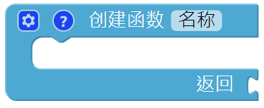

Cliff Detection
===========================

This project will use the **grayscale module** to prevent the PiCar-X from falling off a cliff while it is moving freely around your home. This is an essential project for houses with staircases.

**TIPS**

The **grayscale module** will be performing the same operation multiple times. To simplify the program, this project introduces a **function** that will return a **list** variable to the **do forever** block.

**EXAMPLE**

.. note::

    * You can write the program according to the following picture, please refer to the tutorial: :ref:`ezblock:create_project_latest`.
    * Or find the code with the same name on the **Examples** page of the EzBlock Studio and click **Run** or **Edit** directly.

.. image:: img/sp210512_164755.png

.. image:: img/sp210512_164832.png