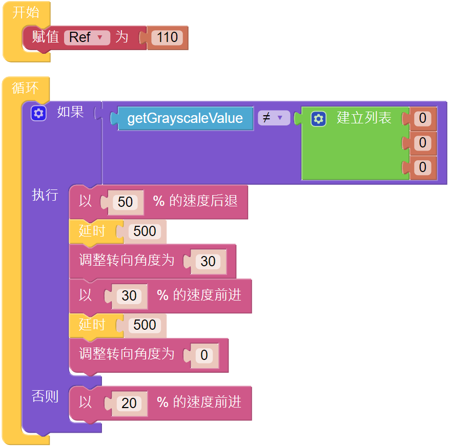
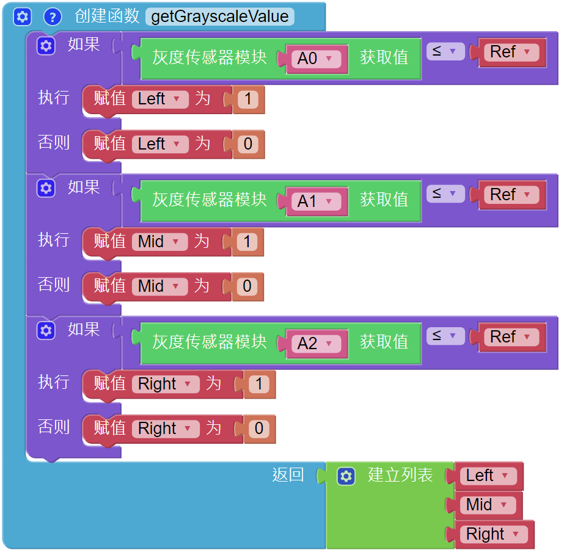

.. note::

    Hola, bienvenido a la Comunidad de Entusiastas de SunFounder Raspberry Pi, Arduino y ESP32 en Facebook. Sumérgete en el mundo de Raspberry Pi, Arduino y ESP32 junto a otros entusiastas.

    **¿Por qué unirse?**

    - **Soporte experto**: Resuelve problemas postventa y desafíos técnicos con la ayuda de nuestra comunidad y equipo.
    - **Aprende y comparte**: Intercambia consejos y tutoriales para mejorar tus habilidades.
    - **Preestrenos exclusivos**: Obtén acceso anticipado a nuevos anuncios de productos y adelantos exclusivos.
    - **Descuentos especiales**: Disfruta de descuentos exclusivos en nuestros productos más recientes.
    - **Promociones festivas y sorteos**: Participa en sorteos y promociones durante las festividades.

    👉 ¿Listo para explorar y crear con nosotros? Haz clic en [|link_sf_facebook|] y únete hoy mismo!

Detección de Acantilados
========================

Este proyecto utilizará el **módulo de escala de grises** para evitar que el PiCar-X se caiga de un acantilado mientras se desplaza libremente por tu hogar. Este es un proyecto esencial para casas con escaleras.

**CONSEJOS**

El **módulo de escala de grises** realizará la misma operación varias veces. Para simplificar el programa, este proyecto introduce una **función** que devolverá una variable **lista** al bloque **hacer siempre**.

**EJEMPLO**

.. note::

    * Puedes escribir el programa según la imagen a continuación, consulta el tutorial: :ref:`ezblock:create_project_latest`.
    * O encuentra el código con el mismo nombre en la página de **Ejemplos** de EzBlock Studio y haz clic en **Ejecutar** o **Editar** directamente.

