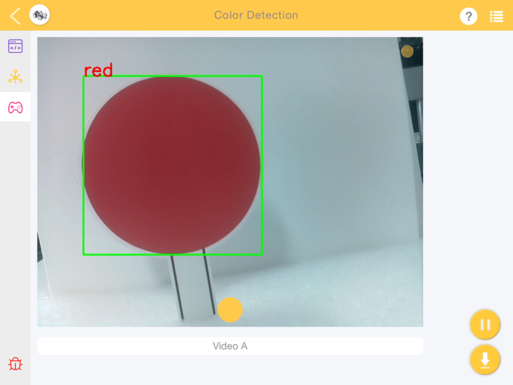
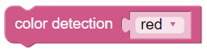
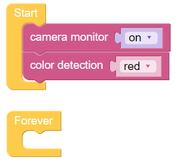

Farberkennung
===========================

Der PiCar-X ist ein selbstfahrendes Auto mit einer integrierten Kamera, die es ermöglicht, Ezblock-Programme für Objekterkennung und Farberkennung zu nutzen. In diesem Abschnitt wird Ezblock verwendet, um ein Programm für die Farberkennung zu erstellen.

.. note::

    Stellen Sie sicher, dass das Flachbandkabel der Raspberry Pi-Kamera ordnungsgemäß und sicher angeschlossen ist, bevor Sie diesen Abschnitt beginnen. Für detaillierte Anweisungen zum sicheren Anschluss des FFC-Kabels siehe: :ref:`assembly_instructions`.

In diesem Programm wird Ezblock zunächst der Farbraum Hue-Saturation-Value (HSV) der zu erkennenden Farbe mitgeteilt. Anschließend wird OpenCV verwendet, um die Farben im HSV-Bereich zu verarbeiten, den Hintergrundrauschen zu entfernen und schließlich die passende Farbe einzurahmen.

Für den PiCar-X bietet Ezblock sechs Farbmodelle: “red”, “orange”, “yellow”, “green”, “blue”, “purple” („rot“, „orange“, „gelb“, „grün“, „blau“ und „lila“) . Farbkarten sind im folgenden PDF vorbereitet und müssen mit einem Farbdrucker ausgedruckt werden.

* :download:`[PDF]Farbkarten <https://github.com/sunfounder/sf-pdf/raw/master/prop_card/object_detection/color-cards.pdf>`

.. image:: img/color_card.png
    :width: 600

.. note::

    Aufgrund von Unterschieden im Druckertoner oder dem bedruckten Medium, wie zum Beispiel sandfarbenem Papier, können die ausgedruckten Farben einen leicht abweichenden Farbton im Vergleich zu den Ezblock-Farbmodellen aufweisen. Dies kann zu einer weniger genauen Farberkennung führen.

**TIPPS**

Ziehen Sie das Video-Widget von der Fernsteuerungsseite, um einen Videomonitor zu erzeugen. Für weitere Informationen zur Verwendung des Video-Widgets siehe das Tutorial zu Ezblock-Video hier: :ref:`ezblock:video_latest`.

.. image:: img/sp210512_121125.png

Aktivieren Sie den Videomonitor, indem Sie den Block **Kameramonitor** auf **ein** setzen. Hinweis: Wenn Sie den **Kameramonitor** auf **aus** setzen, wird der Monitor geschlossen, aber die Objekterkennung bleibt weiterhin verfügbar.

Verwenden Sie den Block **Farberkennung**, um die Farberkennung zu aktivieren. Hinweis: Es kann immer nur eine Farbe gleichzeitig erkannt werden.

**BEISPIEL**

.. note::

    * Sie können das Programm gemäß dem folgenden Bild erstellen. Bitte beziehen Sie sich auf das Tutorial: :ref:`ezblock:create_project_latest`.
    * Oder suchen Sie den Code mit dem gleichen Namen auf der **Beispiele**-Seite des EzBlock Studios und klicken Sie direkt auf **Ausführen** oder **Bearbeiten**.

