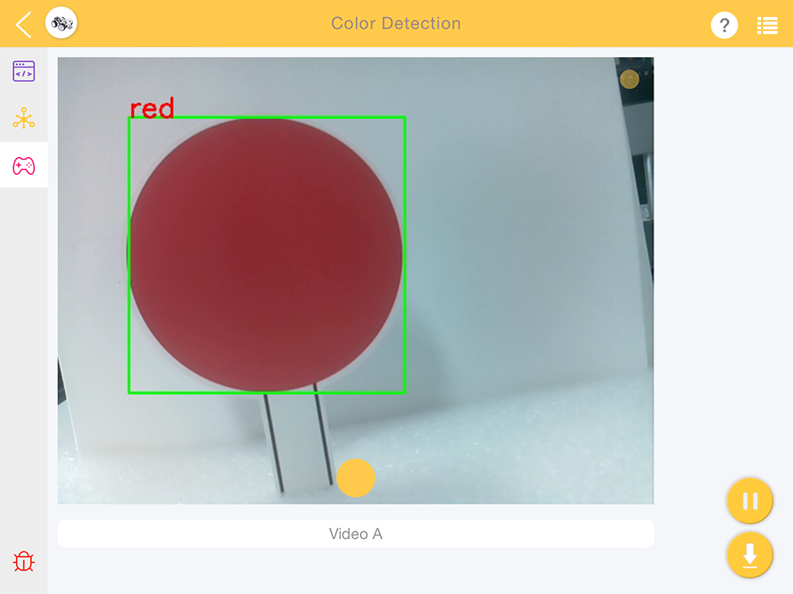
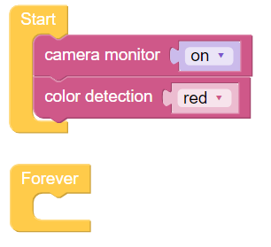

.. note::

    Hola, bienvenido a la Comunidad de Entusiastas de SunFounder Raspberry Pi, Arduino y ESP32 en Facebook. Sumérgete en el mundo de Raspberry Pi, Arduino y ESP32 junto a otros entusiastas.

    **¿Por qué unirse?**

    - **Soporte experto**: Resuelve problemas postventa y desafíos técnicos con la ayuda de nuestra comunidad y equipo.
    - **Aprende y comparte**: Intercambia consejos y tutoriales para mejorar tus habilidades.
    - **Preestrenos exclusivos**: Obtén acceso anticipado a nuevos anuncios de productos y adelantos exclusivos.
    - **Descuentos especiales**: Disfruta de descuentos exclusivos en nuestros productos más recientes.
    - **Promociones festivas y sorteos**: Participa en sorteos y promociones durante las festividades.

    👉 ¿Listo para explorar y crear con nosotros? Haz clic en [|link_sf_facebook|] y únete hoy mismo!

Detección de Color
==================

El PiCar-X es un coche autónomo con una cámara integrada, lo que permite a los programas de Ezblock utilizar el código de detección de objetos y reconocimiento de colores. En esta sección, utilizaremos Ezblock para crear un programa de detección de color. 

.. note:: 

    Antes de comenzar con esta sección, asegúrate de que el cable FFC de la cámara Raspberry Pi esté correctamente y firmemente conectado. Para obtener instrucciones detalladas sobre cómo conectar correctamente el cable FFC, consulta: :ref:`assembly_instructions`.

En este programa, primero se indicará a Ezblock el rango de espacio de Tono-Saturación-Valor (HSV) del color a detectar, luego se utilizará OpenCV para procesar los colores dentro del rango HSV para eliminar el ruido de fondo, y finalmente, se encuadrará el color que coincida.

Ezblock incluye 6 modelos de color para el PiCar-X: "rojo", "naranja", "amarillo", "verde", "azul" y "púrpura". Se han preparado tarjetas de colores en el siguiente PDF, y deberán imprimirse en una impresora a color.

* :download:`[PDF]Color Cards <https://github.com/sunfounder/sf-pdf/raw/master/prop_card/object_detection/color-cards.pdf>`

.. image:: img/color_card.png
    :width: 600

.. note::

    Los colores impresos pueden tener un tono ligeramente diferente al de los modelos de color de Ezblock debido a las diferencias en el tóner de la impresora o en el medio de impresión, como un papel de color beige. Esto puede causar un reconocimiento de color menos preciso.

**CONSEJOS**

Arrastra el widget de Video desde la página de Control remoto, y generará un monitor de video. Para obtener más información sobre cómo usar el widget de Video, consulta el tutorial de Ezblock sobre video aquí: :ref:`ezblock:video_latest`.

Activa el monitor de video configurando el bloque **monitor de cámara** en **encendido**. Nota: Configurar el **monitor de cámara** en **apagado** cerrará el monitor, pero la detección de objetos seguirá estando disponible.

Usa el bloque de **detección de color** para habilitar la detección de color. Nota: solo se puede detectar un color a la vez.

**EJEMPLO**

.. note::

    * Puedes escribir el programa según la imagen a continuación, consulta el tutorial: :ref:`ezblock:create_project_latest`.
    * O encuentra el código con el mismo nombre en la página de **Ejemplos** de EzBlock Studio y haz clic en **Ejecutar** o **Editar** directamente.

