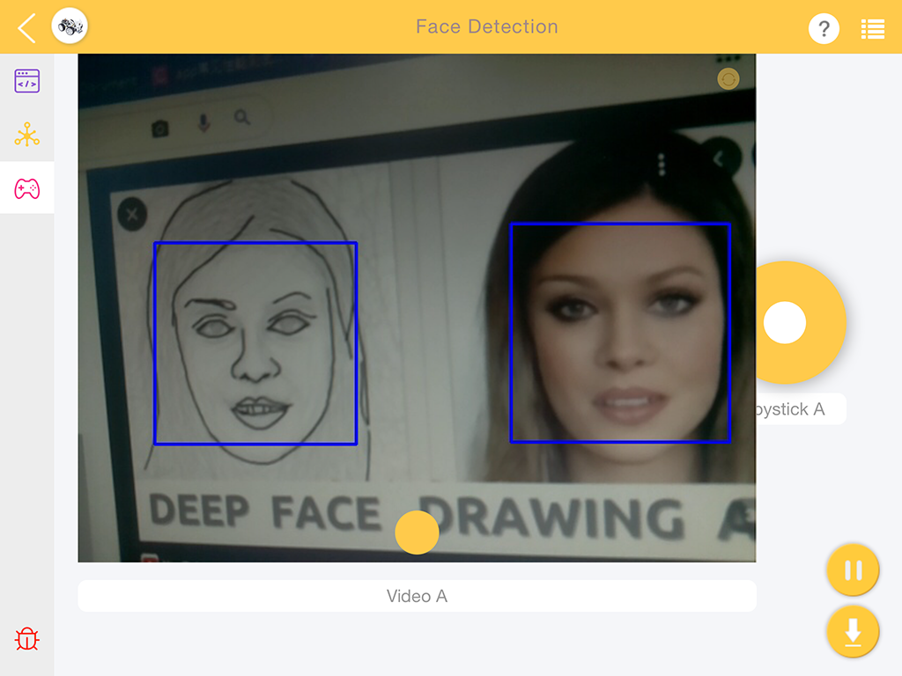
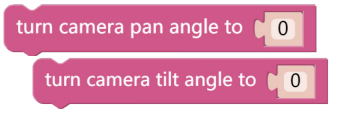
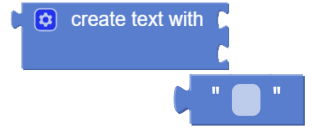
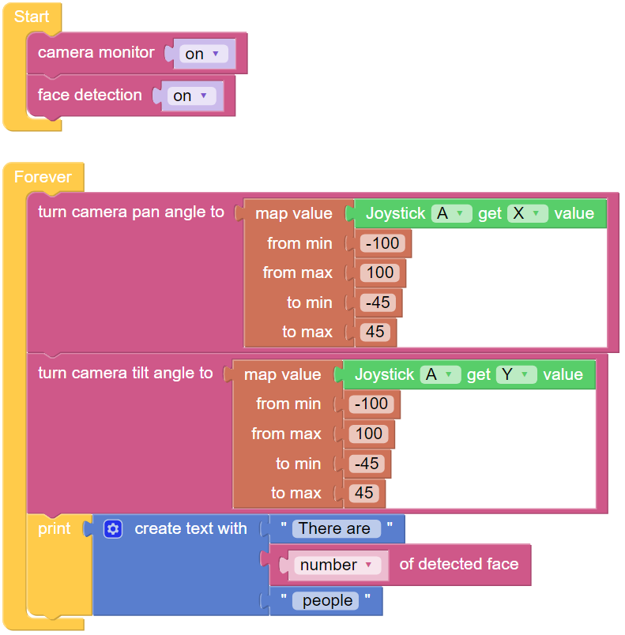

.. note::

    你好，欢迎来到 SunFounder 树莓派、Arduino 和 ESP32 爱好者社区的 Facebook 页面！与其他爱好者一起深入探讨树莓派、Arduino 和 ESP32。

    **为什么加入？**

    - **专家支持**: 通过我们的社区和团队的帮助解决售后问题和技术挑战。
    - **学习与分享**: 交流技巧和教程，提升你的技能。
    - **独家预览**: 提前了解新产品发布和预告。
    - **特别折扣**: 尊享我们最新产品的专属折扣。
    - **节日促销和赠品**: 参与赠品活动和节日促销。

    👉 准备好与我们一起探索和创造了吗？点击 [|link_sf_facebook|] 加入我们吧！

人脸检测
======================

除了颜色检测外，帕克还包含人脸检测功能。 在以下示例中，操纵杆小部件用于调整相机的方向，并且调试监视器中将显示面部数量。

.. 有关如何使用视频小部件的更多信息，请在此处参考有关 EzBlock 视频的教程：
.. `如何使用视频功能？ <https://docs.sunfounder.com/projects/ezblock3/en/latest/use_video.html>`_

**提示**

将 **人脸检测** 设置为 **开** 以启用面部检测。

这两个块用于调整云台相机的方向，类似于 :ref:`远程遥控` 教程中的驾驶帕克。 随着值的增加，相机将向右或向上旋转，减小的值将向右或向下旋转相机。

图像检测结果通过 **检测人脸** 块给出。 使用下拉菜单选项在从图像检测功能读取坐标、大小或结果数量之间进行选择。

使用 **建立字串使用** 块来打印 **文本** 和 **检测人脸** 数据的组合。

**示例**

.. note::

  你可以直接打开我们提供的示例或者是按照下图来编写程序，详细教程请参考 :ref:`open_create`.

代码运行后，你将看到摄像头拍摄的画面；若PiCar-X拍摄到人，它将框选出来。
