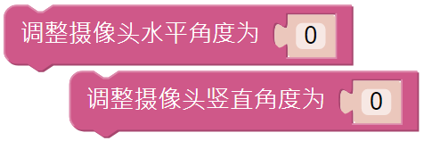
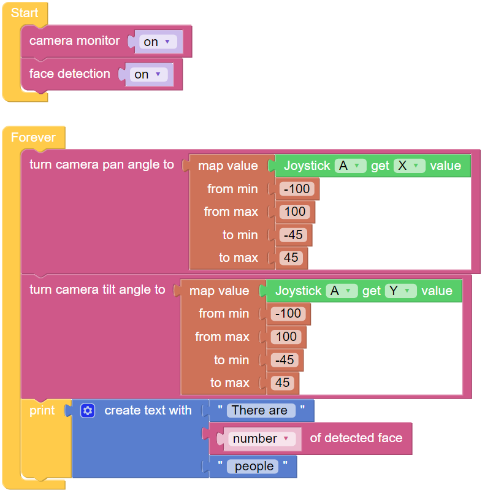

.. note::

    Hallo und willkommen in der SunFounder Raspberry Pi & Arduino & ESP32 Enthusiasten-Gemeinschaft auf Facebook! Tauchen Sie tiefer ein in die Welt von Raspberry Pi, Arduino und ESP32 mit anderen Enthusiasten.

    **Warum beitreten?**

    - **Expertenunterstützung**: Lösen Sie Nachverkaufsprobleme und technische Herausforderungen mit Hilfe unserer Gemeinschaft und unseres Teams.
    - **Lernen & Teilen**: Tauschen Sie Tipps und Anleitungen aus, um Ihre Fähigkeiten zu verbessern.
    - **Exklusive Vorschauen**: Erhalten Sie frühzeitigen Zugang zu neuen Produktankündigungen und exklusiven Einblicken.
    - **Spezialrabatte**: Genießen Sie exklusive Rabatte auf unsere neuesten Produkte.
    - **Festliche Aktionen und Gewinnspiele**: Nehmen Sie an Gewinnspielen und Feiertagsaktionen teil.

    👉 Sind Sie bereit, mit uns zu erkunden und zu erschaffen? Klicken Sie auf [|link_sf_facebook|] und treten Sie heute bei!

Gesichtserkennung
=================

Neben der Farberkennung bietet der PiCar-X auch eine Funktion zur Gesichtserkennung. Im folgenden Beispiel wird das Joystick-Widget zur Steuerung der Kamerarichtung verwendet, und die Anzahl der erkannten Gesichter wird im Debug-Monitor angezeigt.

Für weitere Informationen zur Verwendung des Video-Widgets verweisen wir auf das Tutorial zu Ezblock-Video: :ref:`ezblock:video_latest`.

.. image:: img/face_detection.PNG

**TIPPS**

Aktivieren Sie das **Gesichtserkennung**-Widget, um die Gesichtserkennungsfunktion zu nutzen.

Diese beiden Blöcke dienen zur Anpassung der Ausrichtung der Schwenk-Neige-Kamera, ähnlich wie bei der Steuerung des PiCar-X im Tutorial :ref:`ezb_remote_control`. Ein steigender Wert lässt die Kamera nach rechts oder oben schwenken, ein sinkender Wert nach rechts oder unten.

Die Ergebnisse der Bilderkennung werden über den **detected face**-Block zurückgegeben. Verwenden Sie die Dropdown-Menüoptionen, um zwischen der Ausgabe der Koordinaten, der Größe oder der Anzahl der Ergebnisse aus der Bilderkennungsfunktion zu wählen.

Verwenden Sie den **create text with**-Block, um die Kombination aus **Text** und **detected face**-Daten auszugeben.

**BEISPIEL**

.. note::

    * Das Programm kann gemäß dem folgenden Bild erstellt werden. Bitte beziehen Sie sich auf das Tutorial: :ref:`ezblock:create_project_latest`.
    * Oder finden Sie den Code mit dem gleichen Namen auf der **Beispiele**-Seite des EzBlock Studios und klicken Sie direkt auf **Ausführen** oder **Bearbeiten**.

