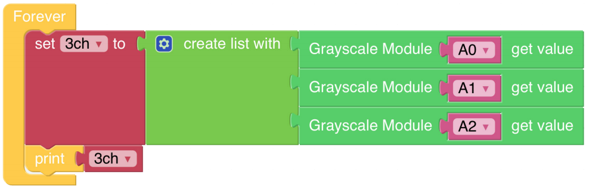

Test Grayscale Module
==============================

PiCar-X includes a Grayscale module for implementing line-following, cliff detection, and other fun experiments. The Grayscale module has three detection sensors that will each report a value according to the shade of color detected by the sensor. For example, a sensor reading the shade of pure black will return a value of “0”.

**TIPS**

Use the **Grayscale module** block to read the value of one of the sensors. In the example above, the “A0” sensor is the sensor on the far left of the PiCar-X. Use the drop-down arrow to change the sensor to “A1” (center sensor), or “A2” (far right sensor).

.. image:: img/sp210512_120023.png

The program is simplified with a **create list with** block. 
A **List** is used in the same way as a single **Variable**, 
but in this case a **List** is more efficient than a single **Variable** because the **Grayscale module** will be reporting more than one sensor value.
The **create list with** block will create separate **Variables** for each sensor, and put them into a List.

**EXAMPLE**

.. note::

    * You can write the program according to the following picture, please refer to the tutorial: `How to Create a New Project? <https://docs.sunfounder.com/projects/ezblock3/en/latest/create_new.html>`_
    * Or find the code with the same name on the **Examples** page of the EzBlock Studio and click **Run** or **Edit** directly.

