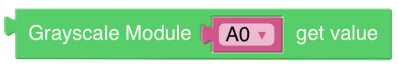
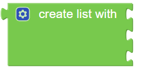
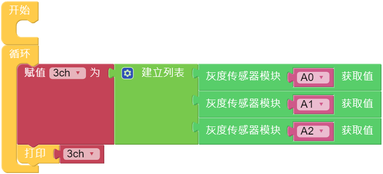

.. note::

    Hola, bienvenido a la Comunidad de Entusiastas de SunFounder Raspberry Pi, Arduino y ESP32 en Facebook. Sumérgete en el mundo de Raspberry Pi, Arduino y ESP32 junto a otros entusiastas.

    **¿Por qué unirse?**

    - **Soporte experto**: Resuelve problemas postventa y desafíos técnicos con la ayuda de nuestra comunidad y equipo.
    - **Aprende y comparte**: Intercambia consejos y tutoriales para mejorar tus habilidades.
    - **Preestrenos exclusivos**: Obtén acceso anticipado a nuevos anuncios de productos y adelantos exclusivos.
    - **Descuentos especiales**: Disfruta de descuentos exclusivos en nuestros productos más recientes.
    - **Promociones festivas y sorteos**: Participa en sorteos y promociones durante las festividades.

    👉 ¿Listo para explorar y crear con nosotros? Haz clic en [|link_sf_facebook|] y únete hoy mismo!

.. _test_grayscale:

Prueba del Módulo de Escala de Grises
=====================================

PiCar-X incluye un módulo de escala de grises para implementar el seguimiento de líneas, la detección de acantilados y otros experimentos divertidos. El módulo de escala de grises tiene tres sensores de detección que informarán un valor según el tono de color detectado por el sensor. Por ejemplo, un sensor que lea el tono del negro puro devolverá un valor de "0".

**CONSEJOS**

Usa el bloque **módulo de escala de grises** para leer el valor de uno de los sensores. En el ejemplo anterior, el sensor "A0" es el sensor en el extremo izquierdo del PiCar-X. Usa la flecha desplegable para cambiar el sensor a "A1" (sensor central) o "A2" (sensor del extremo derecho).

El programa se simplifica con un bloque **crear lista con**. 
Una **Lista** se utiliza de la misma manera que una **Variable** única, 
pero en este caso una **Lista** es más eficiente que una **Variable** única porque el **módulo de escala de grises** informará más de un valor de sensor.
El bloque **crear lista con** creará **Variables** separadas para cada sensor y las pondrá en una Lista.

**EJEMPLO**

.. note::

    * Puedes escribir el programa de acuerdo con la siguiente imagen, consulta el tutorial: :ref:`ezblock:create_project_latest`.
    * O encuentra el código con el mismo nombre en la página de **Ejemplos** de EzBlock Studio y haz clic en **Ejecutar** o **Editar** directamente.

