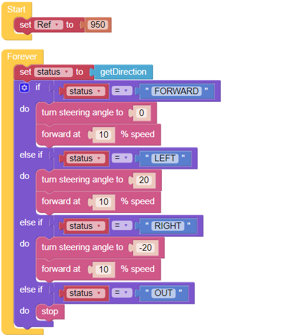

.. _ezb_minecart:

Minecart
=====================

Let’s make a minecart project! This project will use the Grayscale module to make the PiCar-X move forward along a track. 
Use dark-colored tape to make a track on the ground as straight as possible, and not too curved. Some experimenting might be needed if the PiCar-X becomes derailed. 

When moving along the track, the probes on the left and right sides of the Grayscale module will detect light-colored ground, and the middle probe will detect the track. If the track has an arc, the probe on the left or right side of the sensor will detect the dark-colored tape, and turn the wheels in that direction. If the minecart reaches the end of the track or derails, the Grayscale module will no longer detect the dark-colored tape track, and the PiCar-X will come to a stop.

**EXAMPLE**

.. note::

    * You can write the program according to the following picture, please refer to the tutorial: `How to Create a New Project? <https://docs.sunfounder.com/projects/ezblock3/en/latest/create_new.html>`_
    * Or find the code with the same name on the **Examples** page of the EzBlock Studio and click **Run** or **Edit** directly.

.. image:: img/sp210512_171425.png

.. image:: img/sp210512_171454.png