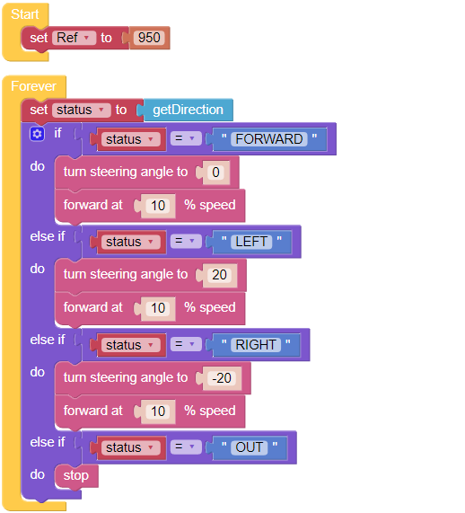

.. note::

    Hola, ¡bienvenido a la Comunidad de Entusiastas de SunFounder Raspberry Pi, Arduino y ESP32 en Facebook! Sumérgete en el mundo de Raspberry Pi, Arduino y ESP32 junto a otros entusiastas.

    **¿Por qué unirse?**

    - **Soporte experto**: Resuelve problemas postventa y desafíos técnicos con la ayuda de nuestra comunidad y equipo.
    - **Aprende y comparte**: Intercambia consejos y tutoriales para mejorar tus habilidades.
    - **Preestrenos exclusivos**: Obtén acceso anticipado a nuevos anuncios de productos y adelantos exclusivos.
    - **Descuentos especiales**: Disfruta de descuentos exclusivos en nuestros productos más recientes.
    - **Promociones festivas y sorteos**: Participa en sorteos y promociones durante las festividades.

    👉 ¿Listo para explorar y crear con nosotros? Haz clic en [|link_sf_facebook|] y únete hoy mismo!

.. _ezb_minecart:

Carro Minero
============

¡Hagamos un proyecto de carro minero! Este proyecto utilizará el módulo de escala de grises para hacer que el PiCar-X avance a lo largo de una pista. 
Usa cinta de color oscuro para crear una pista en el suelo lo más recta posible y no demasiado curva. Puede que necesites hacer algunos ajustes si el PiCar-X se descarrila.

Mientras avanza por la pista, las sondas en los lados izquierdo y derecho del módulo de escala de grises detectarán el suelo de color claro, y la sonda central detectará la pista. Si la pista tiene una curva, la sonda en el lado izquierdo o derecho del sensor detectará la cinta de color oscuro y girará las ruedas en esa dirección. Si el carro minero llega al final de la pista o se descarrila, el módulo de escala de grises dejará de detectar la cinta de color oscuro y el PiCar-X se detendrá.

**CONSEJOS**

* El bloque **Establecer ref a ()** se usa para configurar el umbral de escala de grises, y deberás modificarlo según la situación real. Puedes ejecutar :ref:`test_grayscale` para ver los valores del módulo de escala de grises en las superficies blancas y negras, y llenar con los valores intermedios en este bloque.

**EJEMPLO**

.. note::

    * Puedes escribir el programa según la siguiente imagen, consulta el tutorial: :ref:`ezblock:create_project_latest`.
    * O encuentra el código con el mismo nombre en la página de **Ejemplos** de EzBlock Studio y haz clic en **Ejecutar** o **Editar** directamente.

.. image:: img/sp210512_171425.png

.. image:: img/sp210512_171454.png