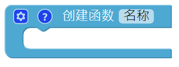
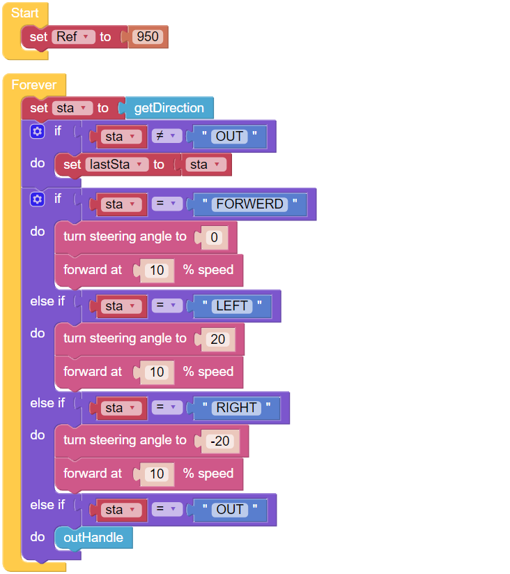
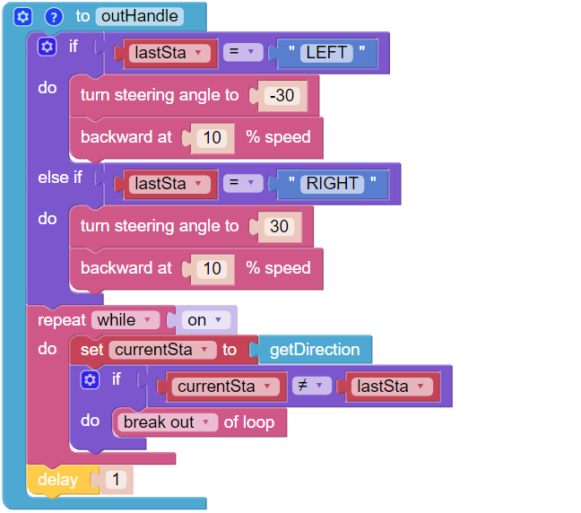
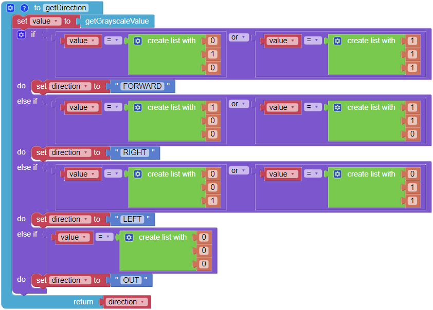

Minecart Plus
=======================

In this project, derailment recovery has been added to the :ref:`ezb_minecart` project to let the PiCar-X adapt and recover from a more severe curve.

.. image:: img/minec.png

**TIPS**

Use another **to do something** block to allow the PiCar-X to back up and recover from a sharp curve. 
Note that the new **to do something** function does not return any values, but is used just for reorienting the PiCar-X.

**EXAMPLE**

.. note::

    * You can write the program according to the following picture, please refer to the tutorial: `How to Create a New Project? <https://docs.sunfounder.com/projects/ezblock3/en/latest/create_new.html>`_
    * Or find the code with the same name on the **Examples** page of the EzBlock Studio and click **Run** or **Edit** directly.

.. image:: img/sp210512_171454.png