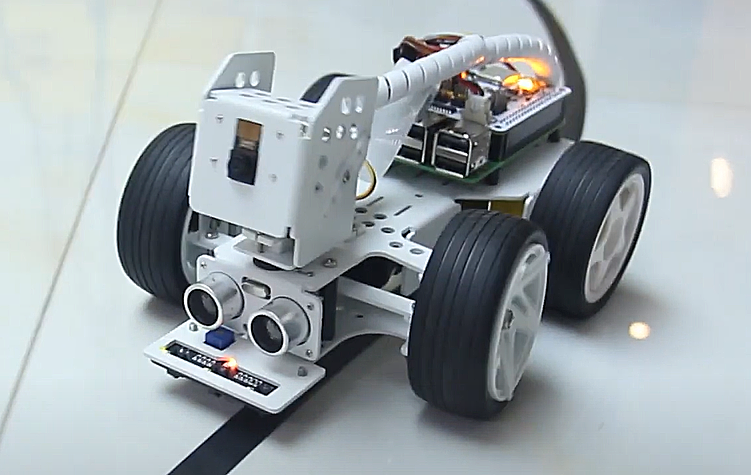
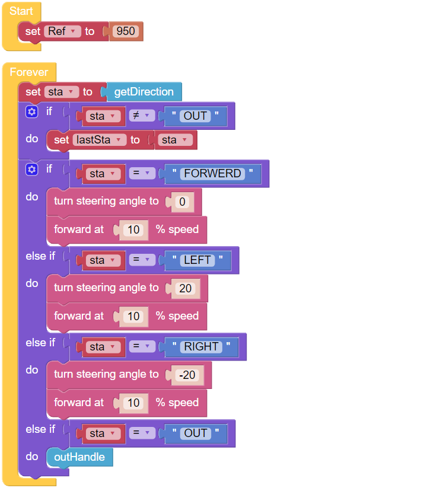
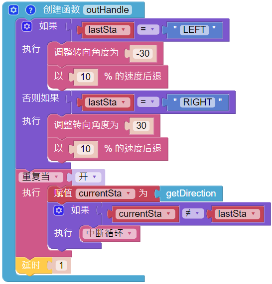
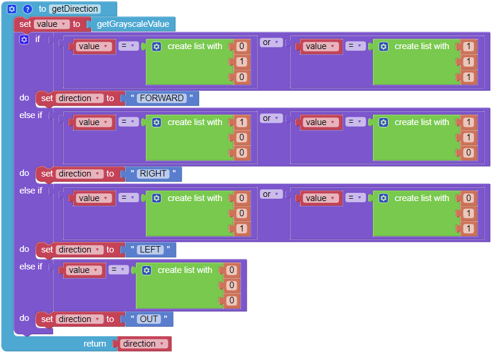
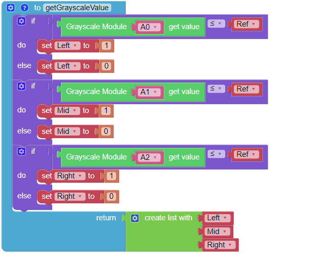

.. note::

    Bonjour et bienvenue dans la communauté Facebook des passionnés de Raspberry Pi, Arduino et ESP32 de SunFounder ! Plongez-vous dans l'univers du Raspberry Pi, Arduino et ESP32 avec d'autres passionnés.

    **Pourquoi nous rejoindre ?**

    - **Support d'experts** : Résolvez vos problèmes après-vente et relevez les défis techniques grâce à l'aide de notre communauté et de notre équipe.
    - **Apprenez & Partagez** : Échangez des astuces et des tutoriels pour améliorer vos compétences.
    - **Aperçus exclusifs** : Bénéficiez d'un accès anticipé aux annonces de nouveaux produits et à des avant-premières.
    - **Remises spéciales** : Profitez de réductions exclusives sur nos produits les plus récents.
    - **Promotions festives et tirages au sort** : Participez à des concours et à des promotions spéciales.

    👉 Prêt à explorer et à créer avec nous ? Cliquez sur [|link_sf_facebook|] et rejoignez-nous dès aujourd'hui !

Minecart Plus
=======================

Dans ce projet, une récupération de déraillement a été ajoutée au projet :ref:`ezb_minecart` pour permettre au PiCar-X de s'adapter et de se redresser après un virage plus serré.

**CONSEILS**

#. Utilisez un autre bloc **pour faire quelque chose** afin de permettre au PiCar-X de reculer et de se réorienter après un virage serré. Notez que la nouvelle fonction **pour faire quelque chose** ne retourne aucune valeur, mais sert simplement à réorienter le PiCar-X.

    .. image:: img/sp210512_171727.png

#. Le bloc **Définir ref sur ()** est utilisé pour définir le seuil de niveaux de gris, vous devez le modifier en fonction de la situation réelle. Vous pouvez exécuter le test :ref:`test_grayscale` pour voir les valeurs du module de niveaux de gris sur les surfaces blanche et noire, et remplir les valeurs intermédiaires dans ce bloc.

**EXEMPLE**

.. note::

    * Vous pouvez écrire le programme en suivant l'image ci-dessous, veuillez consulter le tutoriel : :ref:`ezblock:create_project_latest`.
    * Ou trouvez le code portant le même nom sur la page **Exemples** d'EzBlock Studio, puis cliquez sur **Exécuter** ou **Modifier** directement.

