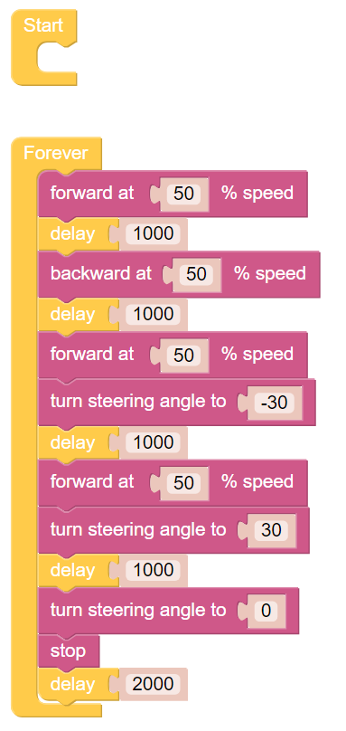

.. note::

    こんにちは、SunFounderのRaspberry Pi & Arduino & ESP32愛好家コミュニティへようこそ！Facebook上でRaspberry Pi、Arduino、ESP32についてもっと深く掘り下げ、他の愛好家と交流しましょう。

    **参加する理由は？**

    - **エキスパートサポート**：コミュニティやチームの助けを借りて、販売後の問題や技術的な課題を解決します。
    - **学び＆共有**：ヒントやチュートリアルを交換してスキルを向上させましょう。
    - **独占的なプレビュー**：新製品の発表や先行プレビューに早期アクセスしましょう。
    - **特別割引**：最新製品の独占割引をお楽しみください。
    - **祭りのプロモーションとギフト**：ギフトや祝日のプロモーションに参加しましょう。

    👉 私たちと一緒に探索し、創造する準備はできていますか？[|link_sf_facebook|]をクリックして今すぐ参加しましょう！

ムーブ
============

この最初のプロジェクトでは、PiCar-X の基本の動きをプログラムする方法を教えます。 このプロジェクトでは、プログラムは PiCar-X に「前進」、「後退」、「左折」、「右折」、「停止」の 5 つのアクションを順番に実行するよう指示します。

Ezblock Studio の基本的な使い方を学ぶには、次の 2 つの章をお読みください。

* :ref:`ezblock:create_project_latest`

.. image:: img/move.png

**ティップス**

このブロックはモーターにかける電圧のパーセンテージに基づいた速度でPiCar-Xを前進させます。 以下の例では、「50」は出力の 50%、つまり半分の出力です。
モーターの性質上あまり細かいコントロールはできず、大体10%ずつくらいで差がわかる程度と思ってください。

このブロックは上記と同じようにして後退の速度を指定します。

.. image:: img/sp210512_113514.png

このブロックは、前輪の向きを調整します。 範囲は「-45」～「45」です。 下の例では、「-30」は前輪が左に 30°回転する(車が左に曲がる)ことを意味します。

.. image:: img/BLK_Basic_delay.png
    :width: 200

このブロックはプログラムの実行を遅らせる時間をミリ秒（1/1000秒）単位に指定します。以下の例では、PiCar-X は次のコマンドを実行する前に 1 秒 (1000 ミリ秒) 待ちます。
なおこの待ち時間の間前進など事前に設定したコマンドは有効のままですから例えば前進中にハンドルを切ったまましばらく進む（曲がってゆく）場合などに使います。

このブロックはPiCar-Xを停止させます。

**例：**

.. note::

    * 次の例を参考にしてプログラムを作成してください。またチュートリアルを参照してください。:ref:`ezblock:create_project_latest`.
    * またはEzBlock Studioの **Examples** 画面から「 **Move** 」を探し **Run** か **Edit** を直接クリックしてください。

