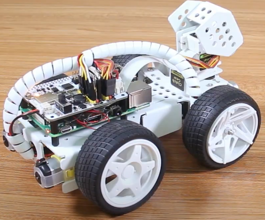
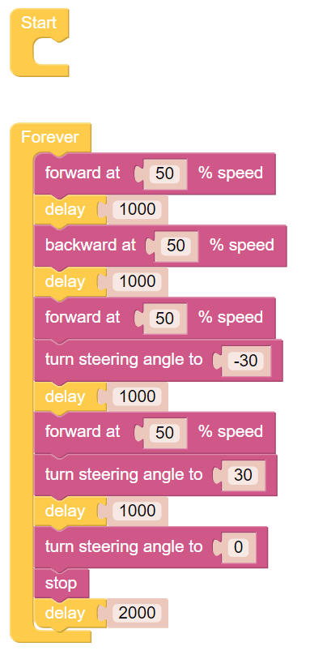

.. note::

    Ciao, benvenuto nella SunFounder Raspberry Pi & Arduino & ESP32 Enthusiasts Community su Facebook! Approfondisci le tue conoscenze su Raspberry Pi, Arduino e ESP32 insieme ad altri appassionati.

    **Perché unirti a noi?**

    - **Supporto Esperto**: Risolvi problemi post-vendita e sfide tecniche con l'aiuto della nostra comunità e del nostro team.
    - **Impara e Condividi**: Scambia suggerimenti e tutorial per migliorare le tue competenze.
    - **Anteprime Esclusive**: Ottieni accesso anticipato agli annunci di nuovi prodotti e alle anteprime.
    - **Sconti Speciali**: Approfitta di sconti esclusivi sui nostri prodotti più recenti.
    - **Promozioni e Giveaway Festivi**: Partecipa a promozioni e concorsi durante le festività.

    👉 Sei pronto a esplorare e creare con noi? Clicca [|link_sf_facebook|] e unisciti oggi stesso!

Movimento
============

Questo primo progetto ti insegna a programmare le azioni di movimento per il PiCar-X. In questo progetto, il programma dirà al PiCar-X di eseguire cinque azioni in sequenza: “avanti”, “indietro”, “gira a sinistra”, “gira a destra” e “stop”.

Per imparare l'uso di base di Ezblock Studio, leggi le seguenti due sezioni:

* :ref:`ezblock:create_project_latest`

**CONSIGLI**

Questo blocco farà muovere il PiCar-X in avanti a una velocità basata su una percentuale della potenza disponibile. Nell'esempio seguente, “50” indica il 50% della potenza, ovvero a metà velocità.

Questo blocco farà muovere il PiCar-X indietro a una velocità basata su una percentuale della potenza disponibile.

Questo blocco regola l'orientamento delle ruote anteriori. L'intervallo è da “-45” a “45”. Nell'esempio seguente, “-30” significa che le ruote si gireranno di 30° a sinistra.

Questo blocco causerà una pausa temporizzata tra i comandi, basata sui millisecondi. Nell'esempio seguente, il PiCar-X aspetterà 1 secondo (1000 millisecondi) prima di eseguire il comando successivo.

Questo blocco fermerà completamente il PiCar-X.

**ESEMPIO**

.. note::

    * Puoi scrivere il programma seguendo l'immagine qui sotto, fai riferimento al tutorial: :ref:`ezblock:create_project_latest`.
    * Oppure trova il codice con lo stesso nome nella pagina **Esempi** di EzBlock Studio e clicca direttamente su **Esegui** o **Modifica**.

