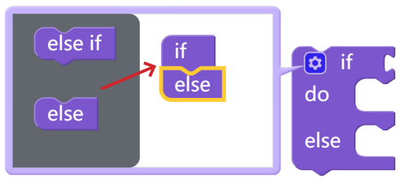
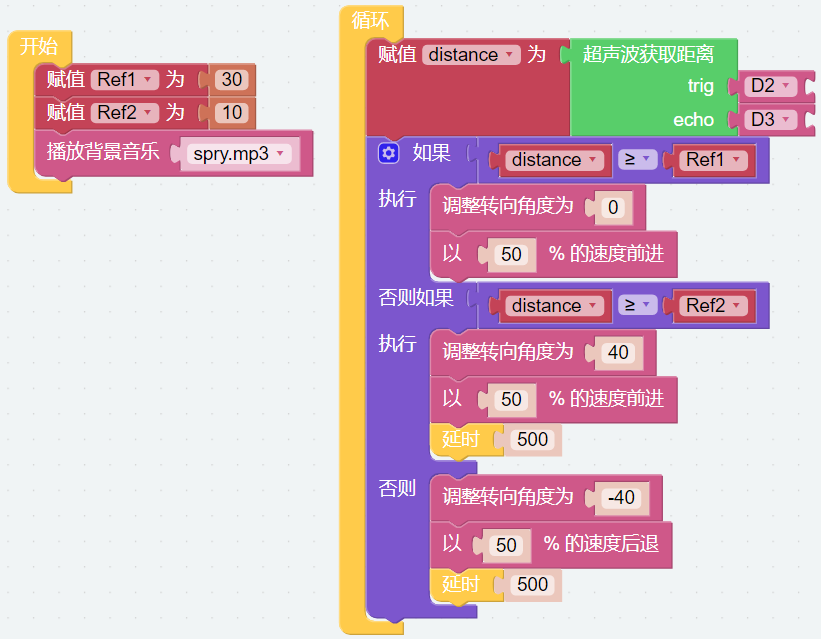

Musikauto
==============

Dieses Projekt verwandelt den PiCar-X in ein Musikauto, das durch Ihr Zuhause fährt und dabei fröhliche Musik abspielt. Außerdem wird gezeigt, wie der PiCar-X mithilfe des integrierten Ultraschallsensors Kollisionen mit Wänden vermeidet.

**TIPPS**

Um mehrere bedingte Abfragen durchzuführen, ändern Sie den einfachen "if do"-Block in einen "if else do / else if do"-Block. Dies erfolgt durch Klicken auf das Einstellungssymbol, wie oben gezeigt.

**BEISPIEL**

.. note::

    * Sie können das Programm gemäß dem folgenden Bild erstellen. Bitte beziehen Sie sich dazu auf das Tutorial: :ref:`ezblock:create_project_latest`.
    * Oder suchen Sie den Code mit dem gleichen Namen auf der **Beispiele**-Seite des EzBlock Studios und klicken Sie direkt auf **Ausführen** oder **Bearbeiten**.

