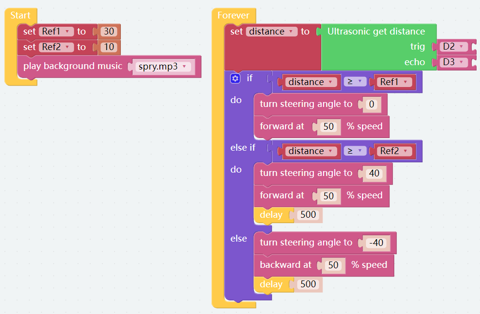

.. note::

    Hola, ¡bienvenido a la Comunidad de Entusiastas de SunFounder Raspberry Pi, Arduino y ESP32 en Facebook! Sumérgete en el mundo de Raspberry Pi, Arduino y ESP32 junto a otros entusiastas.

    **¿Por qué unirte?**

    - **Soporte experto**: Resuelve problemas postventa y desafíos técnicos con la ayuda de nuestra comunidad y equipo.
    - **Aprende y comparte**: Intercambia consejos y tutoriales para mejorar tus habilidades.
    - **Preestrenos exclusivos**: Obtén acceso anticipado a nuevos anuncios de productos y adelantos exclusivos.
    - **Descuentos especiales**: Disfruta de descuentos exclusivos en nuestros productos más recientes.
    - **Promociones festivas y sorteos**: Participa en sorteos y promociones durante las festividades.

    👉 ¿Listo para explorar y crear con nosotros? Haz clic en [|link_sf_facebook|] y únete hoy mismo!

Coche Musical
=============

Este proyecto convertirá el PiCar-X en un coche musical que recorrerá tu casa, reproduciendo música alegre. Este proyecto también demostrará cómo el PiCar-X evita chocar con paredes utilizando el sensor ultrasónico incorporado.

**CONSEJOS**

Para implementar múltiples juicios condicionales, cambia el bloque simple if do a un bloque if else do / else if do. Esto se realiza haciendo clic en el icono de configuración como se muestra arriba.

**EJEMPLO**

.. note::

    * Puedes escribir el programa según la siguiente imagen, por favor revisa el tutorial: :ref:`ezblock:create_project_latest`.
    * O encuentra el código con el mismo nombre en la página de **Ejemplos** de EzBlock Studio y haz clic en **Ejecutar** o **Editar** directamente.

