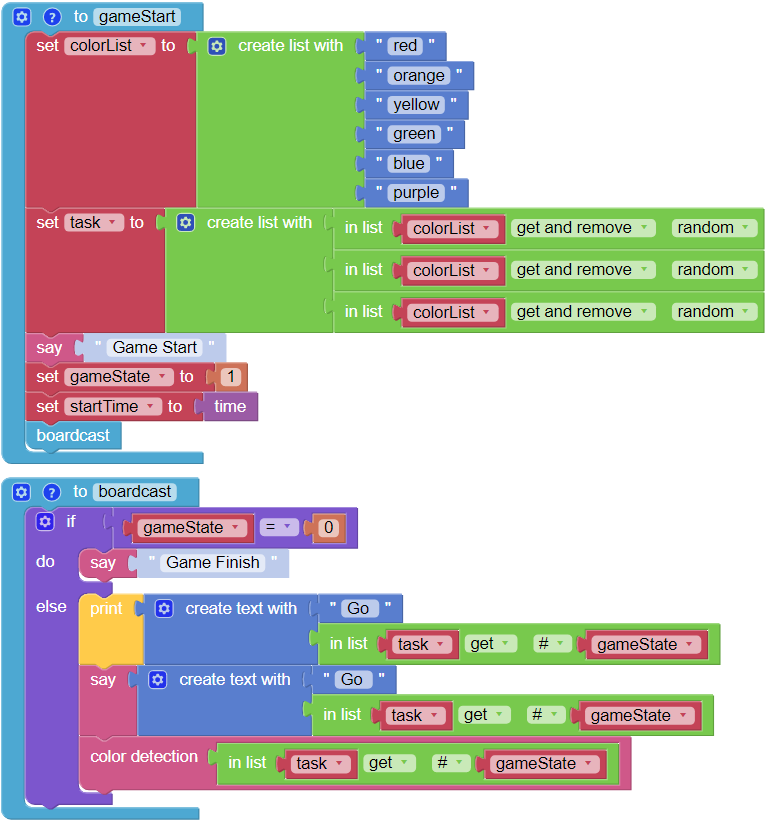
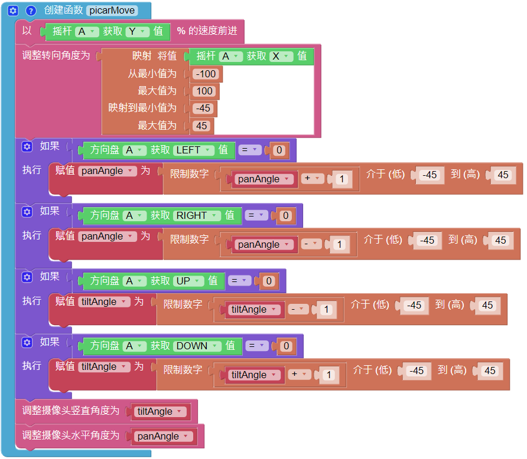

.. note::

    Ciao, benvenuto nella SunFounder Raspberry Pi & Arduino & ESP32 Enthusiasts Community su Facebook! Approfondisci le tue conoscenze su Raspberry Pi, Arduino e ESP32 insieme ad altri appassionati.

    **Perché unirti a noi?**

    - **Supporto Esperto**: Risolvi problemi post-vendita e sfide tecniche con l'aiuto della nostra comunità e del nostro team.
    - **Impara e Condividi**: Scambia suggerimenti e tutorial per migliorare le tue competenze.
    - **Anteprime Esclusive**: Ottieni accesso anticipato agli annunci di nuovi prodotti e alle anteprime.
    - **Sconti Speciali**: Approfitta di sconti esclusivi sui nostri prodotti più recenti.
    - **Promozioni e Giveaway Festivi**: Partecipa a promozioni e concorsi durante le festività.

    👉 Sei pronto a esplorare e creare con noi? Clicca [|link_sf_facebook|] e unisciti oggi stesso!

Orientamento
==================

Questo progetto utilizza la funzione di controllo remoto per guidare il PiCar-X attraverso una caccia al tesoro competitiva!

Per prima cosa, allestisci un percorso a ostacoli, un labirinto o persino una stanza vuota in cui il PiCar-X possa muoversi. Quindi, posiziona sei marcatori lungo il percorso e metti una scheda colorata su ciascuno dei sei marcatori affinché il PiCar-X li trovi.

I sei modelli di colore per PiCar-X sono: rosso, arancione, giallo, verde, blu e viola, pronti per essere stampati con una stampante a colori dal PDF qui sotto.

* :download:`[PDF]Color Cards <https://github.com/sunfounder/sf-pdf/raw/master/prop_card/object_detection/color-cards.pdf>`

.. image:: img/color_card.png

.. note::

    I colori stampati potrebbero avere una tonalità leggermente diversa rispetto ai modelli di colore Ezblock a causa delle differenze del toner della stampante o del supporto di stampa, come una carta di colore marrone chiaro. Questo può causare un riconoscimento dei colori meno preciso.

Il PiCar-X sarà programmato per trovare tre dei sei colori in un ordine casuale, e utilizzerà la funzione TTS per annunciare quale colore cercare successivamente.

L'obiettivo è aiutare il PiCar-X a trovare ciascuno dei tre colori nel minor tempo possibile.

Posiziona il PiCar-X al centro del campo e clicca sul pulsante nella pagina di Controllo Remoto per avviare il gioco.

.. image:: img/orienteering.png

Gioca a turni con i tuoi amici per vedere chi riesce ad aiutare PiCar-X a completare l'obiettivo più velocemente!

**ESEMPIO**

.. note::

    * Puoi scrivere il programma seguendo l'immagine qui sotto, fai riferimento al tutorial: :ref:`ezblock:create_project_latest`.
    * Oppure trova il codice con lo stesso nome nella pagina **Esempi** di EzBlock Studio e clicca direttamente su **Esegui** o **Modifica**.

.. image:: img/sp210513_154117.png
    :width: 800

