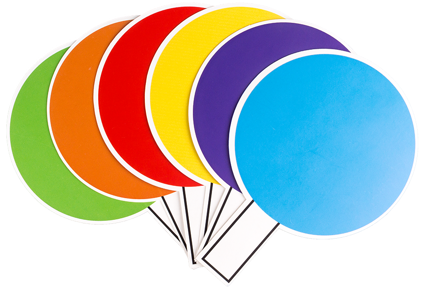
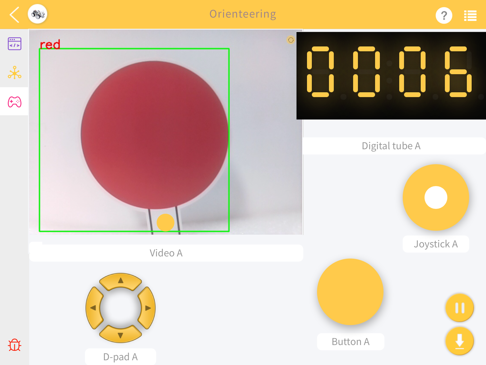
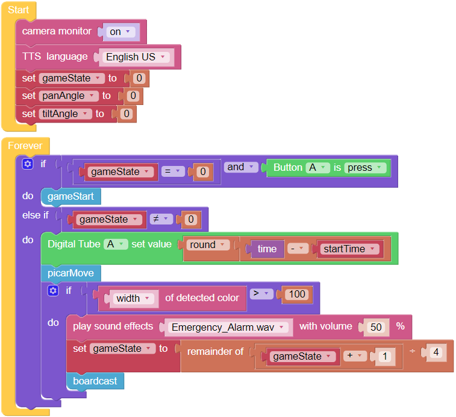
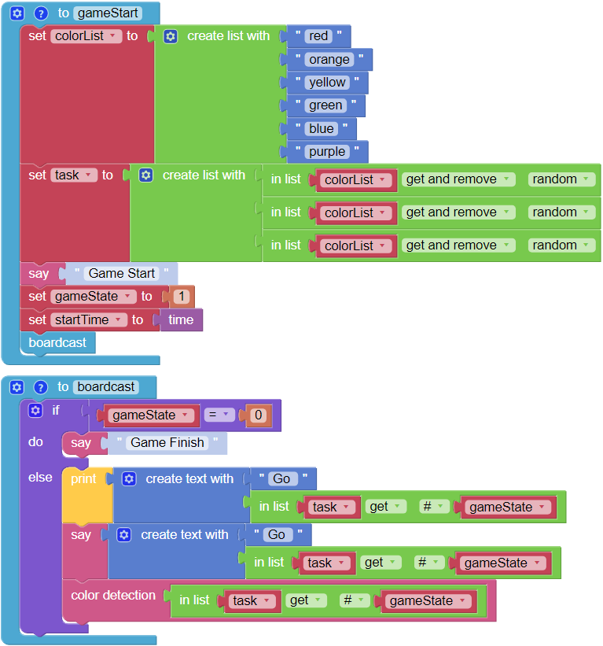
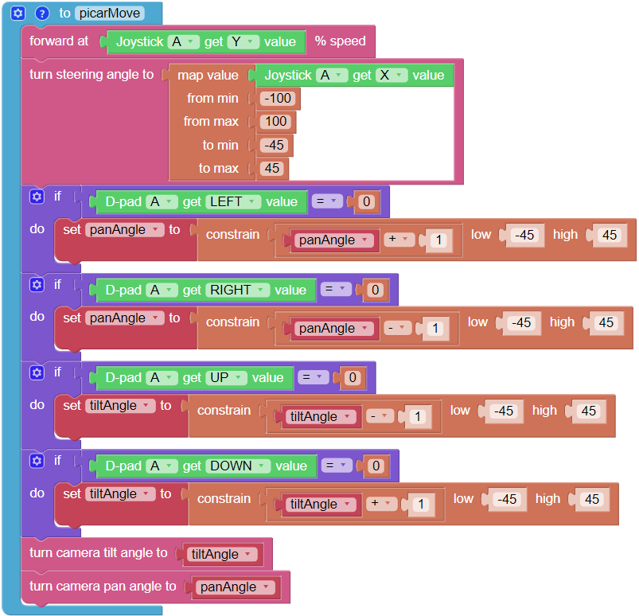

.. note::

    Hola, bienvenido a la Comunidad de Entusiastas de SunFounder Raspberry Pi, Arduino y ESP32 en Facebook. Sumérgete en el mundo de Raspberry Pi, Arduino y ESP32 junto a otros entusiastas.

    **¿Por qué unirte?**

    - **Soporte experto**: Resuelve problemas postventa y desafíos técnicos con la ayuda de nuestra comunidad y equipo.
    - **Aprende y comparte**: Intercambia consejos y tutoriales para mejorar tus habilidades.
    - **Preestrenos exclusivos**: Obtén acceso anticipado a nuevos anuncios de productos y adelantos exclusivos.
    - **Descuentos especiales**: Disfruta de descuentos exclusivos en nuestros productos más recientes.
    - **Promociones festivas y sorteos**: Participa en sorteos y promociones durante las festividades.

    👉 ¿Listo para explorar y crear con nosotros? Haz clic en [|link_sf_facebook|] y únete hoy mismo!

Orientación
===========

Este proyecto utiliza la función de control remoto para guiar al PiCar-X en una emocionante búsqueda del tesoro competitiva.

Primero, organiza un circuito de obstáculos, un laberinto o incluso una habitación vacía por la que pueda circular el PiCar-X. Luego, coloca seis marcadores a lo largo de la ruta y coloca una tarjeta de color en cada marcador para que el PiCar-X las encuentre.

Los seis modelos de color para PiCar-X son: rojo, naranja, amarillo, verde, azul y morado. Están listos para imprimir desde una impresora a color en el PDF a continuación.

* :download:`[PDF]Color Cards <https://github.com/sunfounder/sf-pdf/raw/master/prop_card/object_detection/color-cards.pdf>`

.. note::

    Los colores impresos pueden tener un tono ligeramente diferente en comparación con los modelos de color de Ezblock, debido a las diferencias en el tóner de la impresora o al medio de impresión, como un papel de color marrón. Esto puede causar un reconocimiento de color menos preciso.

El PiCar-X estará programado para encontrar tres de los seis colores en un orden aleatorio y utilizará la función TTS para anunciar cuál será el próximo color a buscar.

El objetivo es ayudar al PiCar-X a encontrar cada uno de los tres colores en el menor tiempo posible.

Coloca el PiCar-X en el centro del campo y haz clic en el botón en la página de Control Remoto para comenzar el juego.

¡Juega por turnos con amigos para ver quién puede ayudar al PiCar-X a completar el objetivo más rápido!

**EJEMPLO**

.. note::

    * Puedes escribir el programa según la siguiente imagen, por favor revisa el tutorial: :ref:`ezblock:create_project_latest`.
    * O encuentra el código con el mismo nombre en la página de **Ejemplos** de EzBlock Studio y haz clic en **Ejecutar** o **Editar** directamente.

