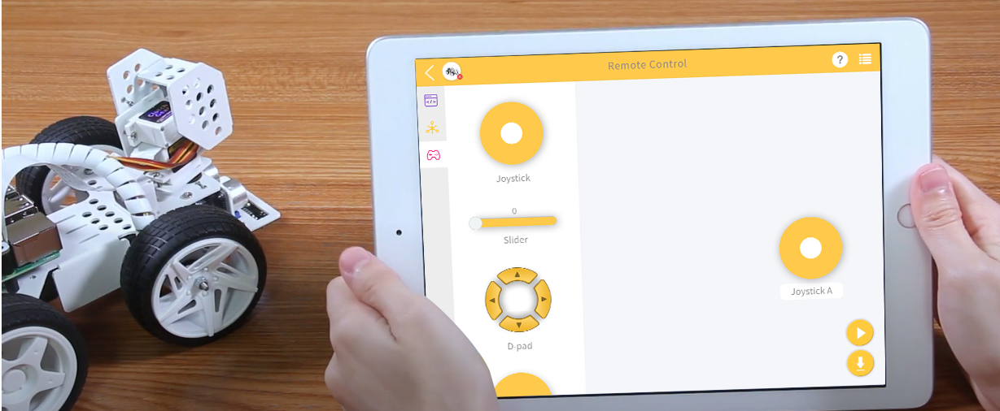
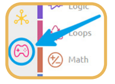
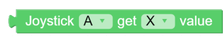

.. note::

    こんにちは、SunFounderのRaspberry Pi & Arduino & ESP32愛好家コミュニティへようこそ！Facebook上でRaspberry Pi、Arduino、ESP32についてもっと深く掘り下げ、他の愛好家と交流しましょう。

    **参加する理由は？**

    - **エキスパートサポート**：コミュニティやチームの助けを借りて、販売後の問題や技術的な課題を解決します。
    - **学び＆共有**：ヒントやチュートリアルを交換してスキルを向上させましょう。
    - **独占的なプレビュー**：新製品の発表や先行プレビューに早期アクセスしましょう。
    - **特別割引**：最新製品の独占割引をお楽しみください。
    - **祭りのプロモーションとギフト**：ギフトや祝日のプロモーションに参加しましょう。

    👉 私たちと一緒に探索し、創造する準備はできていますか？[|link_sf_facebook|]をクリックして今すぐ参加しましょう！

.. _ezb_remote_control:

リモートコントロール
=======================

このプロジェクトでは、ジョイスティックウィジェットを使用してPiCar-Xをリモートで制御する方法を学びます。
注意: リモートコントロールページからジョイスティックウィジェットをドラッグアンドドロップした後、"Map"機能を使用してジョイスティックのX軸とY軸の読み取りをキャリブレーションします。リモートコントロール機能の詳細については、以下のリンクを参照してください：

* :ref:`ezblock:remote_control_latest`

**TIPS**

リモートコントロール機能を使用するには、メインページの左側からリモートコントロールページを開きます。

.. image:: img/sp210512_114042.png

ジョイスティックをリモートコントロールページの中央領域にドラッグします。
中央の白い点をトグルして、任意の方向にゆっくりとドラッグすると、(X,Y)座標が生成されます。
X軸またはY軸の範囲はデフォルトで"-100"から"100"に設定されています。
ジョイスティックの最も左側に直接白い点をドラッグすると、Xの値が"-100"、Yの値が"0"となります。

リモートコントロールページにウィジェットをドラッグアンドドロップすると、
上記のブロックを持つ新しいカテゴリ-リモートが表示されます。
このブロックは、リモートコントロールページでのジョイスティック値を読み取ります。
ドロップダウンメニューをクリックして、Y軸の読み取りに切り替えることができます。

.. image:: img/sp210512_114235.png

マップ値ブロックは、ある範囲から別の範囲に数字をリマップすることができます。
範囲が0から100に設定されており、マップ値が50の場合、それは範囲の50%の位置、すなわち"50"です。
範囲が0から255に設定されており、マップ値が50の場合、それは範囲の50%の位置、すなわち"127.5"です。

**例**

.. note::

    * 以下の画像に従ってプログラムを書くことができます。チュートリアルを参照してください: :ref:`ezblock:create_project_latest`。
    * EzBlock Studioの **Examples** ページで同じ名前のコードを見つけ、 **Run** または **Edit** を直接クリックしてください。

.. image:: img/sp210512_114416.png
