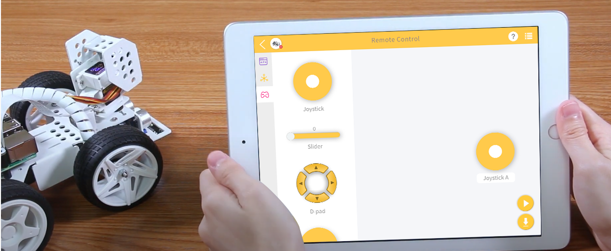
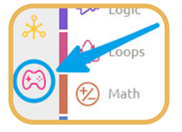
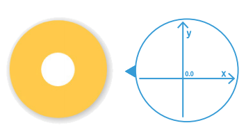
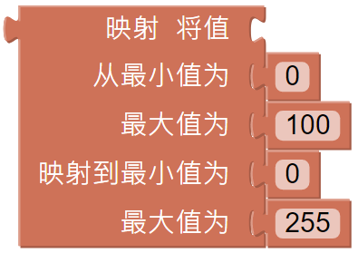
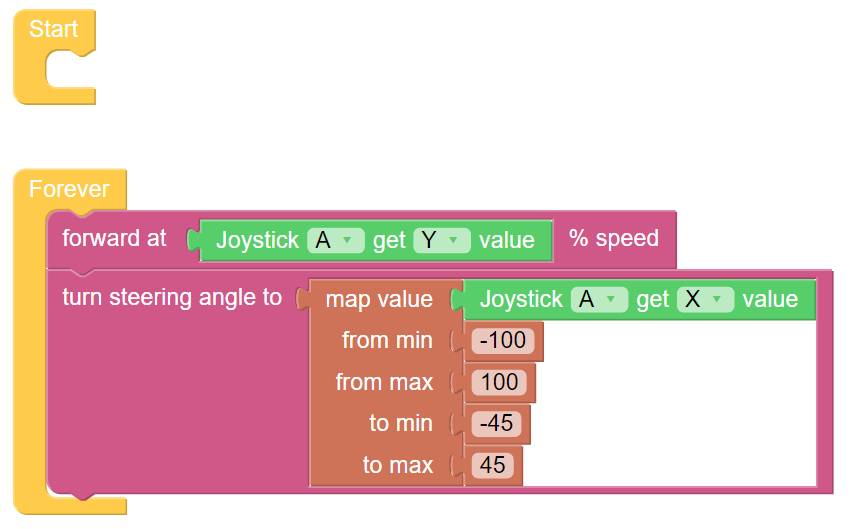

.. note::

    Ciao, benvenuto nella SunFounder Raspberry Pi & Arduino & ESP32 Enthusiasts Community su Facebook! Approfondisci le tue conoscenze su Raspberry Pi, Arduino e ESP32 insieme ad altri appassionati.

    **Perché unirti a noi?**

    - **Supporto Esperto**: Risolvi problemi post-vendita e sfide tecniche con l'aiuto della nostra comunità e del nostro team.
    - **Impara e Condividi**: Scambia suggerimenti e tutorial per migliorare le tue competenze.
    - **Anteprime Esclusive**: Ottieni accesso anticipato agli annunci di nuovi prodotti e alle anteprime.
    - **Sconti Speciali**: Approfitta di sconti esclusivi sui nostri prodotti più recenti.
    - **Promozioni e Giveaway Festivi**: Partecipa a promozioni e concorsi durante le festività.

    👉 Sei pronto a esplorare e creare con noi? Clicca [|link_sf_facebook|] e unisciti oggi stesso!

.. _ezb_remote_control:

Controllo Remoto
=======================

Questo progetto ti insegnerà come controllare da remoto il PiCar-X con il widget Joystick.
Nota: Dopo aver trascinato e rilasciato il widget Joystick dalla pagina del Controllo Remoto, utilizza la funzione “Map” per calibrare le letture degli assi X e Y del Joystick. Per maggiori informazioni sulla funzione di controllo remoto, fai riferimento al seguente link:

* :ref:`ezblock:remote_control_latest`

**CONSIGLI**

Per utilizzare la funzione di controllo remoto, apri la pagina Controllo Remoto dal lato sinistro della pagina principale.

Trascina un Joystick nell'area centrale della pagina Controllo Remoto. Spostando il punto bianco al centro e trascinandolo delicatamente in qualsiasi direzione verranno prodotti dei valori di coordinate (X,Y). L'intervallo dell'asse X o dell'asse Y è impostato di default tra “-100” e “100”. Spostando il punto bianco direttamente a sinistra del Joystick otterrai un valore X di “-100” e un valore Y di “0”.

Dopo aver trascinato e rilasciato un widget sulla pagina di controllo remoto, apparirà una nuova categoria chiamata "Remote" con il blocco sopra indicato.
Questo blocco legge il valore del Joystick nella pagina di Controllo Remoto. Puoi cliccare sul menu a tendina per passare alla lettura dell'asse Y.

Il blocco di rimappatura dei valori può rimappare un numero da un intervallo a un altro. Se l'intervallo è impostato tra 0 e 100, e il numero della rimappatura è 50, allora si trova al 50% della posizione dell'intervallo, ovvero "50". Se l'intervallo è impostato tra 0 e 255 e il numero della rimappatura è 50, allora si trova al 50% della posizione dell'intervallo, ovvero "127,5".

**ESEMPIO**

.. note::

    * Puoi scrivere il programma seguendo l'immagine qui sotto, fai riferimento al tutorial: :ref:`ezblock:create_project_latest`.
    * Oppure trova il codice con lo stesso nome nella pagina **Esempi** di EzBlock Studio e clicca direttamente su **Esegui** o **Modifica**.

