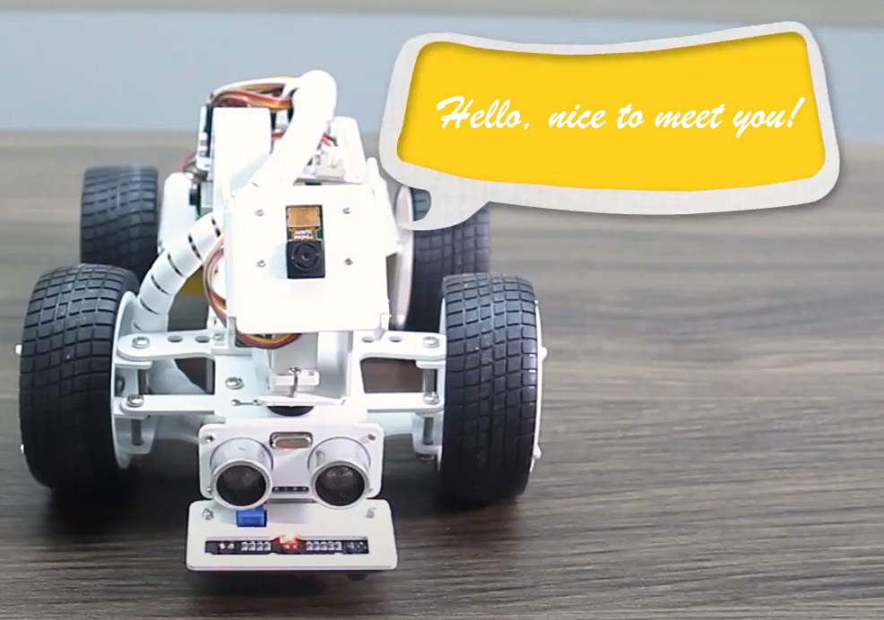
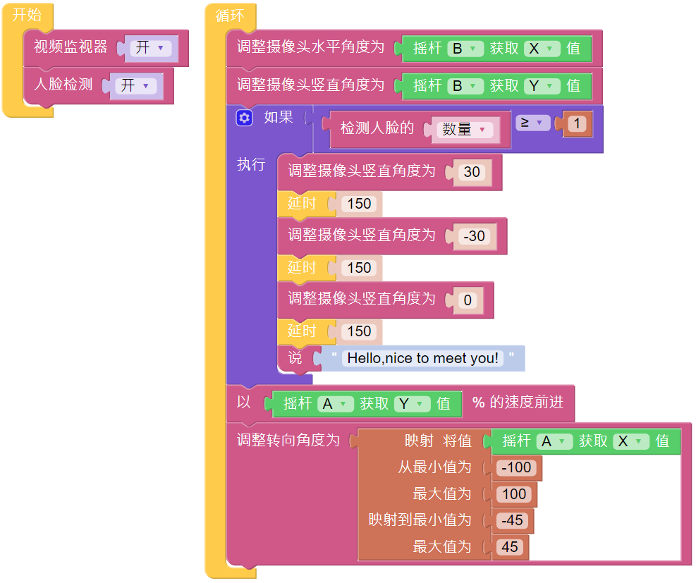

Say Hello
===================

This project will combine several functions from the preceding projects. The PiCar-X movement will be remotely controlled, and the PiCar’s camera will be remotely controlled by using two joystick controllers. When PiCar recognizes someone's face, it will nod politely and then say “Hello!”.

* `How to Use the Video Function <https://docs.sunfounder.com/projects/ezblock3/en/latest/use_video.html>`_
* `How to Use the Remote Control Function <https://docs.sunfounder.com/projects/ezblock3/en/latest/remote.html>`_

**TIPS**

The **if do** block is used to nod politely once the conditional judgment of “if” is true.

The **conditional statements** block is used in conjunction with the **if do** block. The conditions can be “=”, “>”, “<”, ” ≥ “, ” ≤ “, or ” ≠ “.

**EXAMPLE**

.. note::

    * You can write the program according to the following picture, please refer to the tutorial: `How to Create a New Project? <https://docs.sunfounder.com/projects/ezblock3/en/latest/create_new.html>`_
    * Or find the code with the same name on the **Examples** page of the EzBlock Studio and click **Run** or **Edit** directly.

