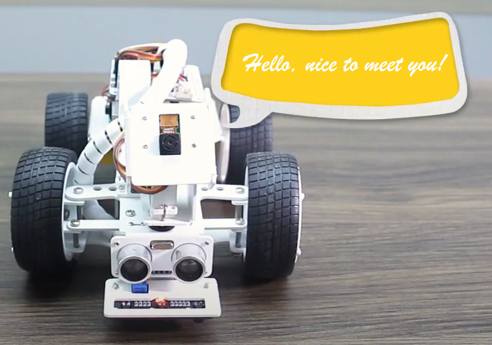
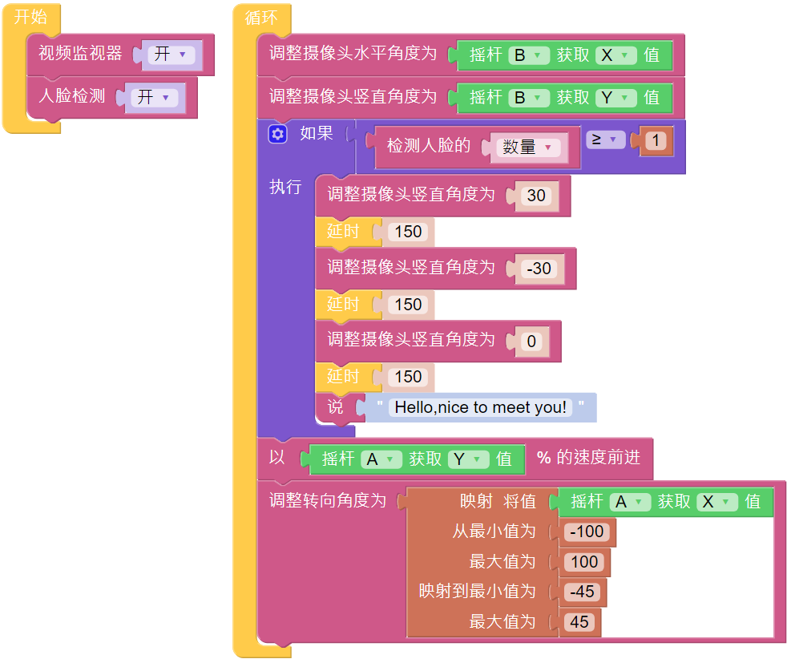

.. note::

    Hallo und willkommen in der SunFounder Raspberry Pi & Arduino & ESP32 Enthusiasten-Gemeinschaft auf Facebook! Tauchen Sie tiefer ein in die Welt von Raspberry Pi, Arduino und ESP32 mit anderen Enthusiasten.

    **Warum beitreten?**

    - **Expertenunterstützung**: Lösen Sie Nachverkaufsprobleme und technische Herausforderungen mit Hilfe unserer Gemeinschaft und unseres Teams.
    - **Lernen & Teilen**: Tauschen Sie Tipps und Anleitungen aus, um Ihre Fähigkeiten zu verbessern.
    - **Exklusive Vorschauen**: Erhalten Sie frühzeitigen Zugang zu neuen Produktankündigungen und exklusiven Einblicken.
    - **Spezialrabatte**: Genießen Sie exklusive Rabatte auf unsere neuesten Produkte.
    - **Festliche Aktionen und Gewinnspiele**: Nehmen Sie an Gewinnspielen und Feiertagsaktionen teil.

    👉 Sind Sie bereit, mit uns zu erkunden und zu erschaffen? Klicken Sie auf [|link_sf_facebook|] und treten Sie heute bei!

Sag Hallo
=========

Dieses Projekt kombiniert mehrere Funktionen aus den vorangegangenen Projekten. Die Bewegung des PiCar-X wird ferngesteuert, und die Kamera des PiCar wird ebenfalls durch zwei Joystick-Controller ferngesteuert. Erkennt das PiCar das Gesicht einer Person, wird es höflich nicken und „Hallo!“ sagen.

* :ref:`ezblock:video_latest`
* :ref:`ezblock:remote_control_latest`

**TIPPS**

Der **if do**-Block wird verwendet, um einmal höflich zu nicken, sobald die bedingte Überprüfung von „if“ wahr ist.

Der **Bedingungen**-Block wird zusammen mit dem **if do**-Block verwendet. Die Bedingungen können „=“, „>“, „<“, „≥“, „≤“ oder „≠“ sein.

**BEISPIEL**

.. note::

    * Sie können das Programm gemäß dem folgenden Bild erstellen, bitte beziehen Sie sich dazu auf das Tutorial: :ref:`ezblock:create_project_latest`.
    * Oder finden Sie den Code mit dem gleichen Namen auf der **Beispiele**-Seite des EzBlock Studios und klicken Sie direkt auf **Ausführen** oder **Bearbeiten**.

