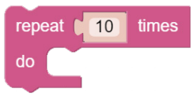
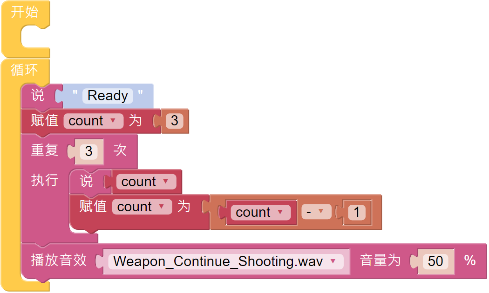

音效
================================

帕克内置扬声器，可用于音频实验。 EzBlock 允许用户输入文字让帕克说话，或制作特定的声音效果。 在本教程中，帕克将使用 **重复多次** 函数，在 3 秒倒计时后发出枪声。

**提示**

使用 **说** 块和 **文本** 块来写一个句子让帕克说。 **说** 块可用于文本或数字。

.. image:: img/sp210512_144150.png

这是一个 **数字** 块。

使用 **重复** 块将重复执行相同的语句，从而减少代码的长度。

.. image:: img/sp210512_144418.png

**数学运算** 块可以执行典型的数学函数，例如“+”、“-”、“x”和“÷”。

.. image:: img/sp210512_144530.png

**播放音效** 块可以播放预设音效，例如警笛声、枪声等。 音量范围可设置为 0 到 100。

**示例**

.. note::

  你可以直接打开我们提供的示例或者是按照下图来编写程序，详细教程请参考 :ref:`open_create`.

