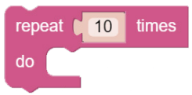
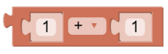
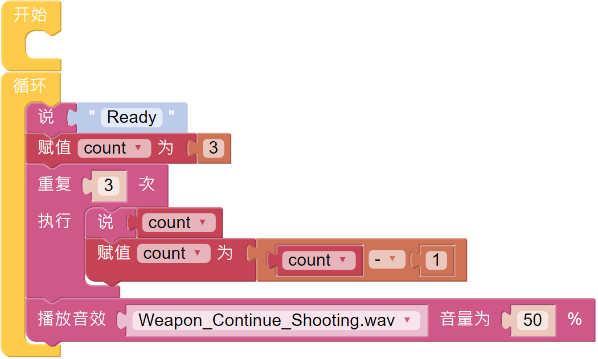

.. note::

    Hola, bienvenido a la Comunidad de Entusiastas de SunFounder Raspberry Pi, Arduino y ESP32 en Facebook. Sumérgete en el mundo de Raspberry Pi, Arduino y ESP32 junto a otros entusiastas.

    **¿Por qué unirte?**

    - **Soporte experto**: Resuelve problemas postventa y desafíos técnicos con la ayuda de nuestra comunidad y equipo.
    - **Aprende y comparte**: Intercambia consejos y tutoriales para mejorar tus habilidades.
    - **Preestrenos exclusivos**: Obtén acceso anticipado a nuevos anuncios de productos y adelantos exclusivos.
    - **Descuentos especiales**: Disfruta de descuentos exclusivos en nuestros productos más recientes.
    - **Promociones festivas y sorteos**: Participa en sorteos y promociones durante las festividades.

    👉 ¿Listo para explorar y crear con nosotros? Haz clic en [|link_sf_facebook|] y únete hoy mismo!

Efecto de sonido
================

El PiCar-X tiene un altavoz incorporado que se puede utilizar para experimentos de audio. Ezblock permite a los usuarios ingresar texto para que el PiCar-X hable o reproduzca efectos de sonido específicos. En este tutorial, el PiCar-X hará el sonido de un disparo después de una cuenta regresiva de 3 segundos, utilizando una función do/while.

**CONSEJOS**

Usa el bloque **say** con un bloque **text** para escribir una frase que el PiCar-X dirá. El bloque **say** se puede usar con texto o números.

El bloque **number**.

Usar el bloque **repeat** repetirá la misma instrucción, lo que reduce el tamaño del código.

El bloque de **operaciones matemáticas** puede realizar funciones matemáticas típicas, como ”+”, “-”, “x” y “÷”.

El bloque **play sound effects - with volume - %** tiene efectos de sonido preestablecidos, como una sirena, el sonido de un disparo, entre otros. El rango del volumen se puede establecer entre 0 y 100.

**EJEMPLO**

.. note::

    * Puedes escribir el programa según la siguiente imagen, consulta el tutorial: :ref:`ezblock:create_project_latest`.
    * O encuentra el código con el mismo nombre en la página de **Ejemplos** de EzBlock Studio y haz clic en **Ejecutar** o **Editar** directamente.

