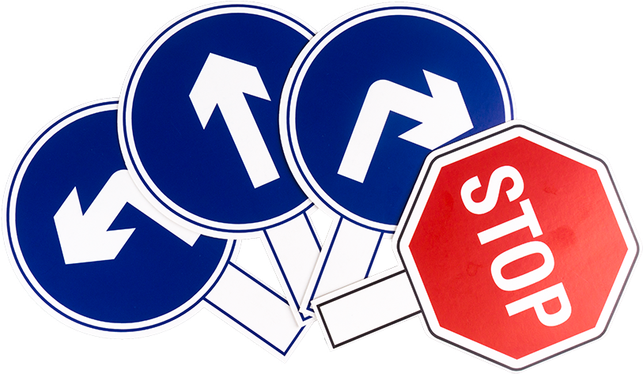
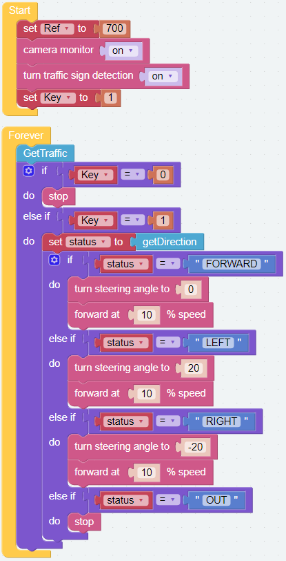
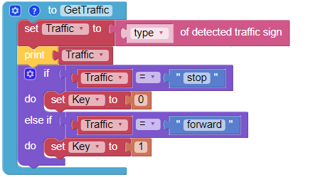

.. note::

    こんにちは、SunFounderのRaspberry Pi & Arduino & ESP32愛好家コミュニティへようこそ！Facebook上でRaspberry Pi、Arduino、ESP32についてもっと深く掘り下げ、他の愛好家と交流しましょう。

    **参加する理由は？**

    - **エキスパートサポート**：コミュニティやチームの助けを借りて、販売後の問題や技術的な課題を解決します。
    - **学び＆共有**：ヒントやチュートリアルを交換してスキルを向上させましょう。
    - **独占的なプレビュー**：新製品の発表や先行プレビューに早期アクセスしましょう。
    - **特別割引**：最新製品の独占割引をお楽しみください。
    - **祭りのプロモーションとギフト**：ギフトや祝日のプロモーションに参加しましょう。

    👉 私たちと一緒に探索し、創造する準備はできていますか？[|link_sf_facebook|]をクリックして今すぐ参加しましょう！

交通標識識別
===============================

このプロジェクトは、画像検出機能を使用して交通標識を探し、PiCar-X を標識の指示に従従わせるものです。 
**traffic sign detection [on]** ブロックは、以下の印刷可能なPDFに含まれている 4つの異なる交通標識を認識します。
PiCar-X が **STOP** 標識を検出すると停止します。
**FORWARD** 標識は前進し、**LEFT** または **RIGHT** 矢印はその方向に曲がります。

* :download:`[PDF]Traffic Sign Cards <https://github.com/sunfounder/sf-pdf/raw/master/prop_card/object_detection/traffic-sign-cards.pdf>`

.. note::

     印刷された色は、プリンターのトナーの違い、または印刷用紙のわずかな色の違いなどによって、Ezblockが設定した色とはわずかに異なる色合いになる場合があります。 これにより認識の精度が低下する可能性があります。

このプロジェクトは :ref:`ezb_minecart` に基づいていますが、グレースケール・センサーを使用する代わりにカメラによる交通標識検出の機能を使用します。 検出結果は、Ezblock Studio のビデオ モニターでも確認できます。

.. image:: img/traffic_detect.PNG

**ティップス**

.. note::

    * 次の例を参考にしてプログラムを作成してください。またチュートリアルを参照してください。:ref:`ezblock:create_project_latest`.
    * またはEzBlock Studioの **Examples** 画面から「 **Traffic Sign Detection** 」を探し **Run** か **Edit** を直接クリックしてください。

.. image:: img/sp210512_171425.png

.. image:: img/sp210512_171454.png