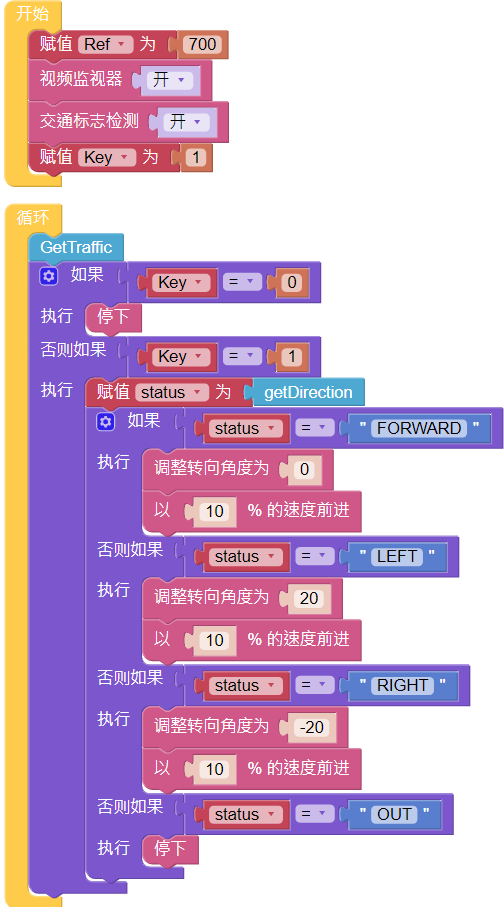
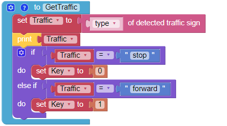

.. note::

    Bonjour et bienvenue dans la communauté Facebook des passionnés de Raspberry Pi, Arduino et ESP32 de SunFounder ! Plongez-vous dans l'univers du Raspberry Pi, Arduino et ESP32 avec d'autres passionnés.

    **Pourquoi nous rejoindre ?**

    - **Support d'experts** : Résolvez vos problèmes après-vente et relevez les défis techniques grâce à l'aide de notre communauté et de notre équipe.
    - **Apprenez & Partagez** : Échangez des astuces et des tutoriels pour améliorer vos compétences.
    - **Aperçus exclusifs** : Bénéficiez d'un accès anticipé aux annonces de nouveaux produits et à des avant-premières.
    - **Remises spéciales** : Profitez de réductions exclusives sur nos derniers produits.
    - **Promotions festives et concours** : Participez à des tirages au sort et à des promotions durant les fêtes.

    👉 Prêt à explorer et à créer avec nous ? Cliquez sur [|link_sf_facebook|] et rejoignez-nous dès aujourd'hui !

Détection des panneaux de signalisation
============================================

En plus de la détection des couleurs et des visages, le PiCar-X peut également détecter les panneaux de signalisation.

Combinons maintenant cette détection avec la fonction de suivi de ligne. Laissez le PiCar-X suivre la ligne, et lorsqu'un panneau Stop est placé devant lui, il s'arrête. Lorsque vous placez un panneau Avancer, il continue de se déplacer vers l'avant.

**CONSEILS**

#. PiCar reconnaîtra 4 modèles de panneaux de signalisation différents inclus dans le PDF imprimable ci-dessous.

    .. image:: img/taffics_sign.png

    * :download:`[PDF]Traffic Sign Cards <https://github.com/sunfounder/sf-pdf/raw/master/prop_card/object_detection/traffic-sign-cards.pdf>`

#. Le bloc **Définir ref sur ()** est utilisé pour ajuster le seuil de niveaux de gris. Vous devez le modifier en fonction de la situation réelle. Vous pouvez exécuter le test :ref:`test_grayscale` pour voir les valeurs du module de niveaux de gris sur les surfaces blanche et noire, puis remplir leurs valeurs intermédiaires dans ce bloc.

**EXEMPLE**

.. note::

    * Vous pouvez écrire le programme en suivant l'image ci-dessous, veuillez consulter le tutoriel : :ref:`ezblock:create_project_latest`.
    * Ou trouvez le code portant le même nom sur la page **Exemples** d'EzBlock Studio, puis cliquez sur **Exécuter** ou **Modifier** directement.

.. image:: img/sp210512_171425.png

.. image:: img/sp210512_171454.png
