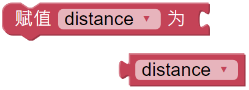
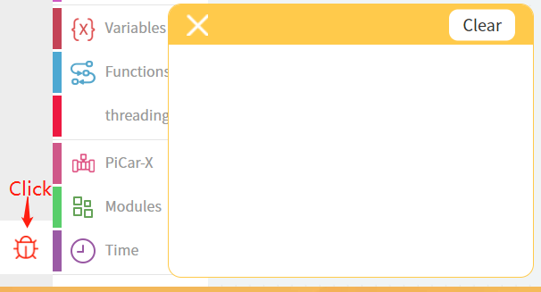
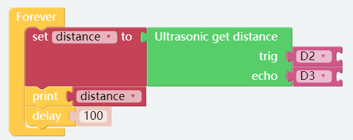

.. note::

    こんにちは、SunFounderのRaspberry Pi & Arduino & ESP32愛好家コミュニティへようこそ！Facebook上でRaspberry Pi、Arduino、ESP32についてもっと深く掘り下げ、他の愛好家と交流しましょう。

    **参加する理由は？**

    - **エキスパートサポート**：コミュニティやチームの助けを借りて、販売後の問題や技術的な課題を解決します。
    - **学び＆共有**：ヒントやチュートリアルを交換してスキルを向上させましょう。
    - **独占的なプレビュー**：新製品の発表や先行プレビューに早期アクセスしましょう。
    - **特別割引**：最新製品の独占割引をお楽しみください。
    - **祭りのプロモーションとギフト**：ギフトや祝日のプロモーションに参加しましょう。

    👉 私たちと一緒に探索し、創造する準備はできていますか？[|link_sf_facebook|]をクリックして今すぐ参加しましょう！

超音波モジュール試験
==============================

PiCar-Xには障害物回避や自動物体追跡実験に使用できる超音波センサーが組み込まれています。 このプロジェクトではセンサーは距離をセンチメートル単位で読み取り、結果を **デバッグ** ウィンドウに **表示** します。

**ティップス**

.. image:: img/sp210512_114549.png 

**Ultrasonic get distance** ブロックは、PiCar-X から前方の障害物までの距離を読み取ります。

このプログラムは **変数** の使い方を練習しましょう。 
たとえば、プログラム内に障害物までの距離を使用する必要がある複数の関数がある場合、 **変数** を使用して各関数が距離を個別に読み取る代わりに一度計測したデータを各関数で同じ値を利用できます。

.. image:: img/sp210512_114916.png

**Variables** カテゴリの **Create variable...** ボタンをクリックし、名前の欄に例えば「 **distance** 」という変数の名前を入力します。

**Print** 関数はデバッグを容易にするために変数やテキストなどのデータを画面に表示できます。

コード（プログラム）が実行されたら、左下隅にある **デバッグ** アイコンをクリックして、デバッグ モニターを有効にします。

**例：**

.. note::

    * 次の例を参考にしてプログラムを作成してください。またチュートリアルを参照してください。:ref:`ezblock:create_project_latest`.
    * またはEzBlock Studioの **Examples** 画面から「 **Ultrasonic Sencor Test** 」を探し **Run** か **Edit** を直接クリックしてください。

