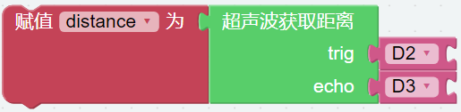
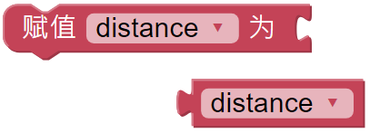
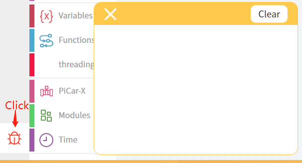
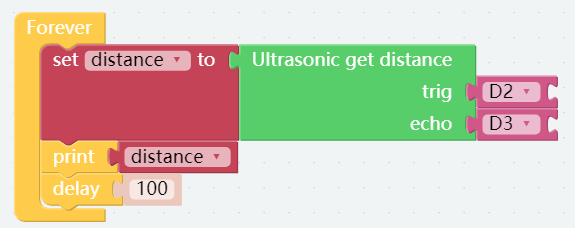

.. note::

    Bonjour et bienvenue dans la communauté Facebook des passionnés de Raspberry Pi, Arduino et ESP32 de SunFounder ! Plongez-vous dans l'univers du Raspberry Pi, Arduino et ESP32 avec d'autres passionnés.

    **Pourquoi nous rejoindre ?**

    - **Support d'experts** : Résolvez vos problèmes après-vente et relevez les défis techniques grâce à l'aide de notre communauté et de notre équipe.
    - **Apprenez & Partagez** : Échangez des astuces et des tutoriels pour améliorer vos compétences.
    - **Aperçus exclusifs** : Bénéficiez d'un accès anticipé aux annonces de nouveaux produits et à des avant-premières.
    - **Remises spéciales** : Profitez de réductions exclusives sur nos nouveaux produits.
    - **Promotions festives et concours** : Participez à des tirages au sort et à des promotions durant les fêtes.

    👉 Prêt à explorer et à créer avec nous ? Cliquez sur [|link_sf_facebook|] et rejoignez-nous dès aujourd'hui !

Test du module ultrasonique
==============================

Le PiCar-X est équipé d'un module à capteur ultrasonique intégré qui peut être utilisé pour l'évitement d'obstacles et les expériences de suivi automatique d'objets. Dans cette leçon, le module mesurera une distance en centimètres (24 cm = 1 pouce), et **affichera** les résultats dans une fenêtre de **débogage**.

**CONSEILS**

Le bloc **Ultrasonic get distance** mesurera la distance entre le PiCar-X et un obstacle situé directement en face.

Ce programme est simplifié avec une **Variable**. Par exemple, lorsqu'il y a plusieurs fonctions dans un programme qui doivent utiliser la distance d'un obstacle, une **Variable** peut être utilisée pour rapporter la même valeur de distance à chaque fonction, au lieu que chaque fonction ne la lise séparément.

Cliquez sur le bouton **Créer une variable...** dans la catégorie **Variables**, et utilisez la flèche déroulante pour sélectionner la variable nommée “distance”.

La fonction **Print** peut afficher des données comme des variables et du texte pour faciliter le débogage.

Une fois le code exécuté, activez le moniteur de débogage en cliquant sur l'icône **Debug** dans le coin inférieur gauche.

**EXEMPLE**

.. note::

    * Vous pouvez écrire le programme en suivant l'image ci-dessous, veuillez consulter le tutoriel : :ref:`ezblock:create_project_latest`.
    * Ou trouvez le code portant le même nom sur la page **Exemples** d'EzBlock Studio, puis cliquez sur **Exécuter** ou **Modifier** directement.

