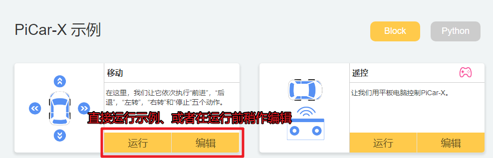

.. note::

    Bonjour et bienvenue dans la communauté Facebook des passionnés de Raspberry Pi, Arduino et ESP32 de SunFounder ! Plongez-vous dans l'univers du Raspberry Pi, Arduino et ESP32 avec d'autres passionnés.

    **Pourquoi nous rejoindre ?**

    - **Support d'experts** : Résolvez vos problèmes après-vente et relevez les défis techniques grâce à l'aide de notre communauté et de notre équipe.
    - **Apprenez & Partagez** : Échangez des astuces et des tutoriels pour améliorer vos compétences.
    - **Aperçus exclusifs** : Bénéficiez d'un accès anticipé aux annonces de nouveaux produits et à des avant-premières.
    - **Remises spéciales** : Profitez de réductions exclusives sur nos derniers produits.
    - **Promotions festives et concours** : Participez à des tirages au sort et à des promotions durant les fêtes.

    👉 Prêt à explorer et à créer avec nous ? Cliquez sur [|link_sf_facebook|] et rejoignez-nous dès aujourd'hui !

.. _play_ezblock:

Jouer avec Ezblock
===========================

.. note::

    Si vous utilisez un Raspberry Pi 5, vous ne pourrez pas utiliser notre logiciel de programmation graphique, EzBlock, pour programmer le PiCrawler.

Pour les débutants et novices, EzBlock est une plateforme de développement logiciel proposée par SunFounder pour Raspberry Pi. EzBlock propose deux environnements de programmation : un environnement graphique et un environnement Python.

Il est disponible pour presque tous les types d'appareils, y compris Mac, PC et Android.

Voici un tutoriel pour vous aider à installer, télécharger et utiliser EzBlock.

.. toctree::
  :maxdepth: 1

  quick_guide_on_ezblock
  get_start_app
  calibrate_the_car

**Projets**

Cette section commence par les fonctions de programmation de base pour le PiCar-X et se poursuit jusqu'à la création de programmes plus avancés dans EzBlock Studio. 
Chaque tutoriel contient des CONSEILS introduisant de nouvelles fonctions, permettant aux utilisateurs d'écrire le programme correspondant. 
Il y a également un code de référence complet dans la section Exemple qui peut être utilisé directement. 
Nous vous suggérons d'essayer de programmer sans utiliser le code dans les sections Exemple, et de profiter de l'expérience amusante de relever les défis !

Tous les projets EzBlock ont été téléchargés sur la page Exemples d'EzBlock Studio. Depuis cette page, les utilisateurs peuvent exécuter les programmes directement, ou modifier les exemples et les enregistrer dans le dossier Mes Projets.

La page Exemples permet aux utilisateurs de choisir entre le langage par blocs ou le langage Python. Les projets de cette section n'expliquent que le langage par blocs ; pour une explication du code Python, veuillez consulter ce `fichier <https://github.com/sunfounder/picar-x/blob/v2.0/docs/(EN)%20picarmini.md>`_ afin de mieux comprendre le code Python.

**Basique**

.. toctree::

    ezblock_move
    ezblock_remote_control
    ezblock_ultrasonic
    ezblock_grayscale
    ezblock_color_detection
    ezblock_face_detection
    ezblock_sound_effect
    ezblock_background_music
    ezblock_say_hello
    ezblock_music_car
    ezblock_cliff_detection
    ezblock_minecart
    ezblock_minecart_plus
    ezblock_bullfight
    ezblock_beware_pedestrians
    ezblock_traffic
    ezblock_orienteering
