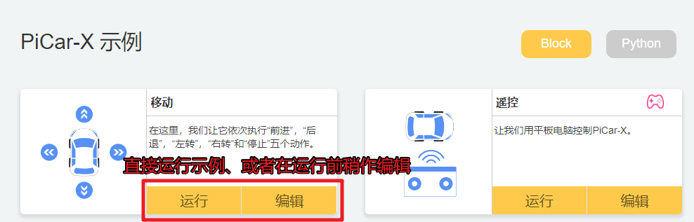

.. note::

    Hola, ¡bienvenido a la Comunidad de Entusiastas de SunFounder Raspberry Pi, Arduino y ESP32 en Facebook! Sumérgete en el mundo de Raspberry Pi, Arduino y ESP32 junto a otros entusiastas.

    **¿Por qué unirte?**

    - **Soporte experto**: Resuelve problemas postventa y desafíos técnicos con la ayuda de nuestra comunidad y equipo.
    - **Aprende y comparte**: Intercambia consejos y tutoriales para mejorar tus habilidades.
    - **Preestrenos exclusivos**: Obtén acceso anticipado a nuevos anuncios de productos y adelantos exclusivos.
    - **Descuentos especiales**: Disfruta de descuentos exclusivos en nuestros productos más recientes.
    - **Promociones festivas y sorteos**: Participa en sorteos y promociones especiales durante las festividades.

    👉 ¿Listo para explorar y crear con nosotros? Haz clic en [|link_sf_facebook|] y únete hoy mismo!

.. _play_ezblock:

Juega con Ezblock
=================

Para principiantes y novatos, EzBlock es una plataforma de desarrollo de software ofrecida por SunFounder para Raspberry Pi. EzBlock ofrece dos entornos de programación: un entorno gráfico y un entorno Python.

Está disponible para casi todos los tipos de dispositivos, incluidos Mac, PC y Android.

Aquí tienes un tutorial para ayudarte a completar la instalación, descarga y uso de EzBlock.

.. toctree::
  :maxdepth: 1

  quick_guide_on_ezblock
  get_start_app
  calibrate_the_car

**Proyectos**

Esta sección comienza con funciones de programación básicas para el PiCar-X y continúa hasta la creación de programas más avanzados en EzBlock Studio. 
Cada tutorial contiene TIPS que introducen nuevas funciones, permitiendo a los usuarios escribir el programa correspondiente. 
También hay un código de referencia completo en la sección de Ejemplos que se puede usar directamente. 
Sugerimos intentar la programación sin usar el código de la sección de Ejemplos y disfrutar de la experiencia divertida de superar los desafíos.

Todos los proyectos de EzBlock se han subido a la página de Ejemplos de EzBlock Studio. Desde la página de Ejemplos, los usuarios pueden ejecutar los programas directamente o editar los ejemplos y guardarlos en la carpeta Mis Proyectos.

La página de Ejemplos permite a los usuarios elegir entre lenguaje por Bloques o Python. Los proyectos en esta sección solo explican el lenguaje por Bloques, para una explicación del código Python, por favor revisa este `archivo <https://github.com/sunfounder/picar-x/blob/v2.0/docs/(EN)%20picarmini.md>`_ para ayudarte a entender el código Python.

**Básico**

.. toctree::

    ezblock_move
    ezblock_remote_control
    ezblock_ultrasonic
    ezblock_grayscale
    ezblock_color_detection
    ezblock_face_detection
    ezblock_sound_effect
    ezblock_background_music
    ezblock_say_hello
    ezblock_music_car
    ezblock_cliff_detection
    ezblock_minecart
    ezblock_minecart_plus
    ezblock_bullfight
    ezblock_beware_pedestrians
    ezblock_traffic
    ezblock_orienteering

