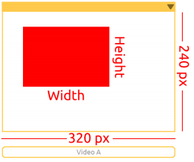

Bullfight
==============

Turn PiCar-X into an angry bull! Prepare a red cloth. When PiCar-X chases after the red cloth, be careful not to be hit by it. This project is more difficult than the previous one. 
You need to use the color detection function to make the camera always face the red cloth. Then adjust the body orientation according to the angle of the camera head.

**TIPS**

.. image:: img/block/sp210512_174650.png

Here we need to use "object detection" which is used to detect the quantity in "Color Detection". Now we know more about its usage.

.. image:: img/block/sp210512_174807.png

The "object detection" can output the detected coordinate value (x, y) based on the center point of 
the graphic. The screen is divided into a 3x3 grid, as shown on the left.

The “object detection” can detect the size (Width & Height) of the graphic. 
In the above two usages, if multiple targets are identified, the largest target will be the sole result.

**EXAMPLE**

.. image:: img/block/sp210512_175519.png