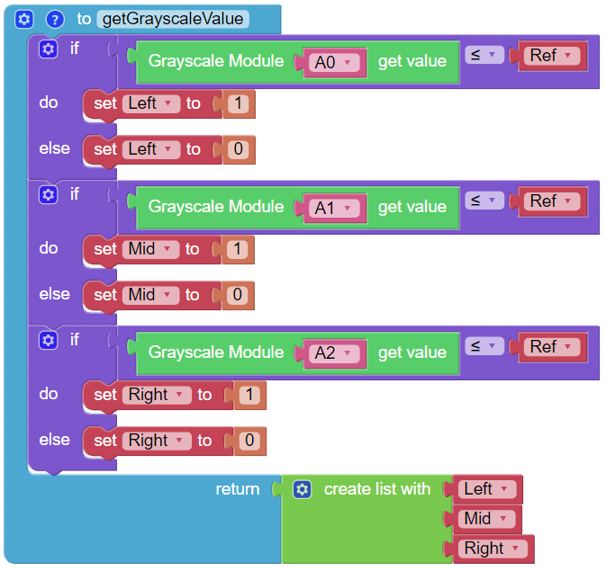

悬崖检测
============================

该项目将使用 **灰度模块** 来防止帕克在自由移动时从悬崖上掉下来。 

**提示**

**灰度模块** 将多次执行相同的操作。 为了简化程序，该项目引入了一个 **创建函数** ，它将向 **循环** 块返回一个 **列表** 变量。

**例子**

.. image:: img/block/sp210512_164755.png

