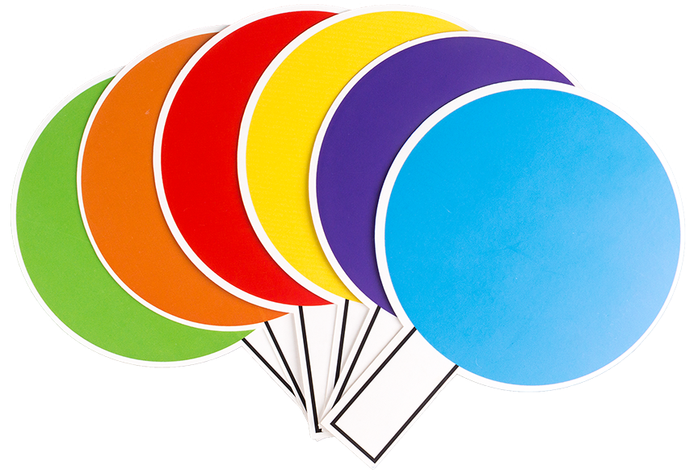

Color Detection
===========================

PiCar-X is a Self-driving car with Camera. Ezblock also provides some object detection functions. Here we try color detection. Prior to this, you must ensure that the Pi Camera 
FFC cable is properly and securely connected.

We trained 6 color models for PiCar-X, red, orange, yellow, green, blue and purple. You can print them yourself, but you need to make sure they are printed in color.

* `Color Cards File <https://github.com/sunfounder/picar-x/blob/v2.0/printfile/Color%20Cards.pdf>`_

.. note::

    Please understand that the printed traffic sign cardboard may be a little different from the one we trained because of the color difference or material, which will lead to a less accurate recognition.

* `How to Use the Video Function? <https://docs.sunfounder.com/projects/ezblock3/en/latest/use_video.html>`_

.. image:: img/block/ezblock_color_detect.PNG

**TIPS**

.. image:: img/block/sp210512_121105.png

Here we drag a Video widget from the remote Control page, and it will generate a monitor.

.. image:: img/block/sp210512_121125.png

You need to enable the video monitor by setting above block to on. Setting it to **off** will close the monitor (but not object detection).

.. image:: img/block/sp210512_134133.png

You can use this block to enable the color detection, only one color can be detected for one time.

**EXAMPLE**

.. image:: img/block/sp210512_134636.png