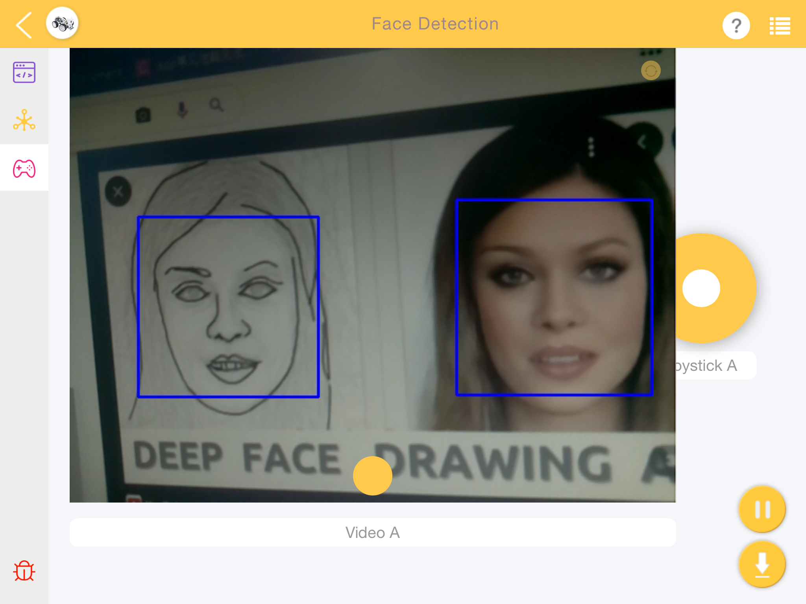
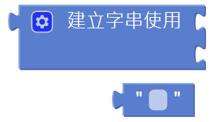

Face Detection
======================

In addition to color detection, PiCar-X also includes a face detection function. In the following example the Joystick widget is used to adjust the direction of the camera, and the number of faces will be displayed in the debug monitor.

For more information on how to use the Video widget, please reference the tutorial on Ezblock video here: 
`How to Use the Video Function? <https://docs.sunfounder.com/projects/ezblock3/en/latest/use_video.html>`_

**TIPS**

Set the **face detection** widget to **on** to enable facial detection.

.. image:: img/block/sp210512_142327.png

These two blocks are used to adjust the orientation of the pan-tilt camera, similar to driving the PiCar-X in the :ref:`Remote Control` tutorial. As the value increases, the camera will rotate to the right, or upwards, a decreasing value will rotate the camera right, or downwards.

.. image:: img/block/sp210512_142407.png

The image detection results are given through the of **detected face** block. Use the drop-down menu options to choose between reading the coordinates, size, or number of results from the image detection function.

Use the **create text with** block to print the combination of **text** and of **detected face** data.

**EXAMPLE**

.. image:: img/block/sp210512_142830.png