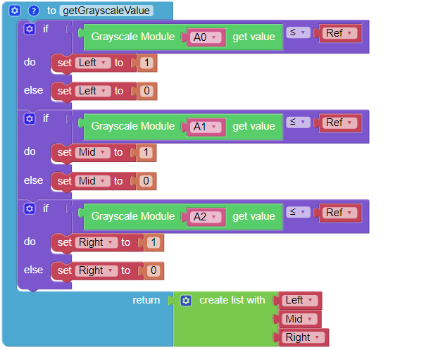

矿车
======================

让我们做一个矿车项目吧！ 本项目将使用灰度模块使帕克沿着轨道向前移动。
使用深色胶带在地面上制作一条轨道，不要有太大的转弯幅度，否则可能脱离轨道。

沿着轨道移动时，灰度模块左右两侧的探头会检测到浅色地面，中间的探头会检测到轨道。 如果轨道有弧线，传感器左侧或右侧的探头将检测到深色胶带，并朝该方向转动车轮。 如果矿车到达轨道末端或脱轨，灰度模块将不再检测到深色磁带轨道，帕克将停下来。

**例子**

.. image:: img/block/sp210512_170342.png

.. image:: img/block/sp210512_171425.png

