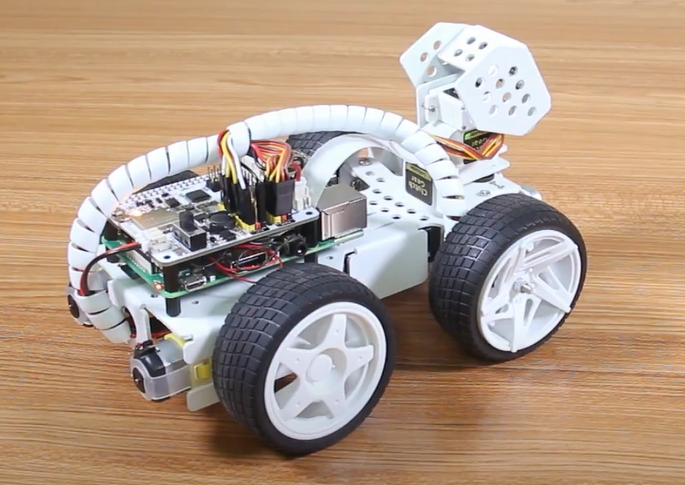

移动
============

第一个项目教授如何为帕克编程运动动作。 在这个项目中，程序会告诉帕克依次执行五个动作：“前进”、“后退”、“左转”、“右转”和“停止”。

.. 学习Ezblock Studio的基本使用，请通读以下两节：

.. * `Ezblock 快速用户指南 <https://docs.sunfounder.com/projects/ezblock3/en/latest/quick_user_guide_for_ezblock3.html>`_

.. * `如何创建一个新项目？ <https://docs.sunfounder.com/projects/ezblock3/en/latest/create_new.html>`_

**提示**

.. image:: img/block/sp210512_113300.png

该模块将使帕克以基于可用功率百分比的速度前进。 在下面的示例中，“50”是功率的 50%，或者说是半速。

.. image:: img/block/sp210512_113418.png

该模块将使帕克以基于可用功率百分比的速度向后移动。

.. image:: img/block/sp210512_113514.png

该块调整前轮的方向。 范围是“-45”到“45”。 在下面的示例中，“-30”表示车轮将向左转 30°。

此块将导致命令之间的定时中断，基于毫秒。 在下面的示例中，帕克在执行下一个命令之前将等待 1 秒（1000 毫秒）。

.. image:: img/block/sp210512_113550.png

该块将使帕克完全停止。

**示例**

.. image:: img/block/sp210512_113827.png

