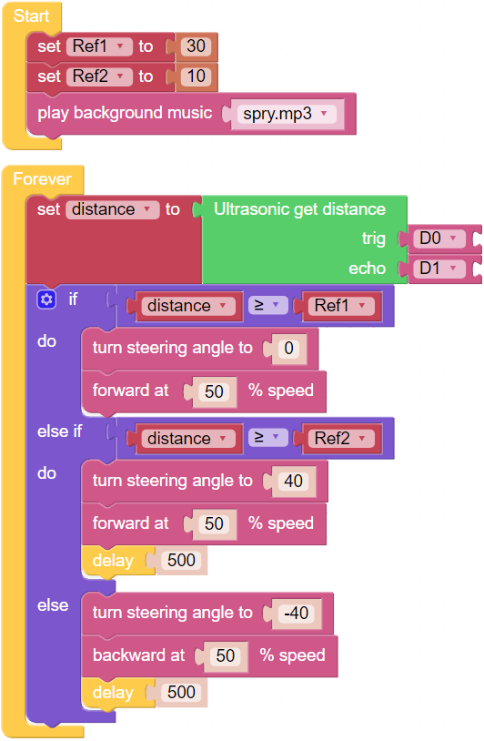

Music Car
==============

Next we try to make a music car that walks around your home, plays music and brings you a good mood. In this project, you will need to avoid it hitting the wall with an ultrasonic sensor.

**TIPS**

.. image:: img/block/sp210512_163224.png

When you need to implement multiple conditional judgments, you will have to change if do into if else do or else if do.
This can be achieved by clicking on the setting icon.

**EXAMPLE**

