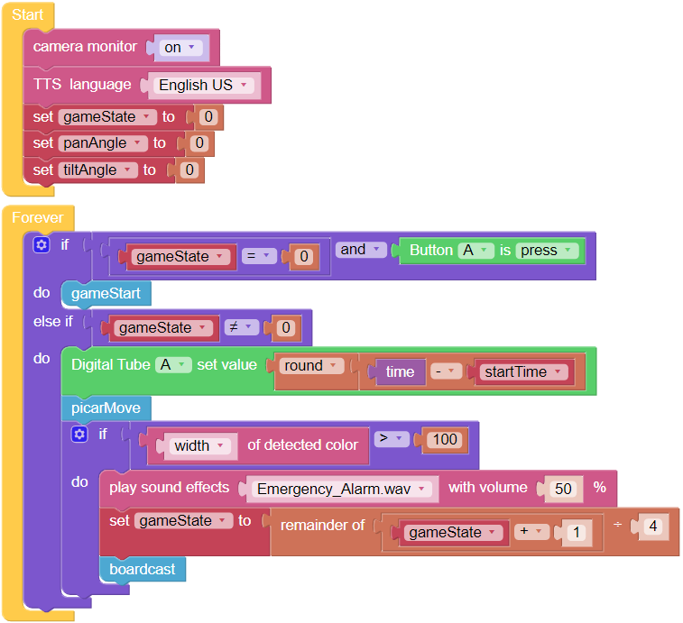
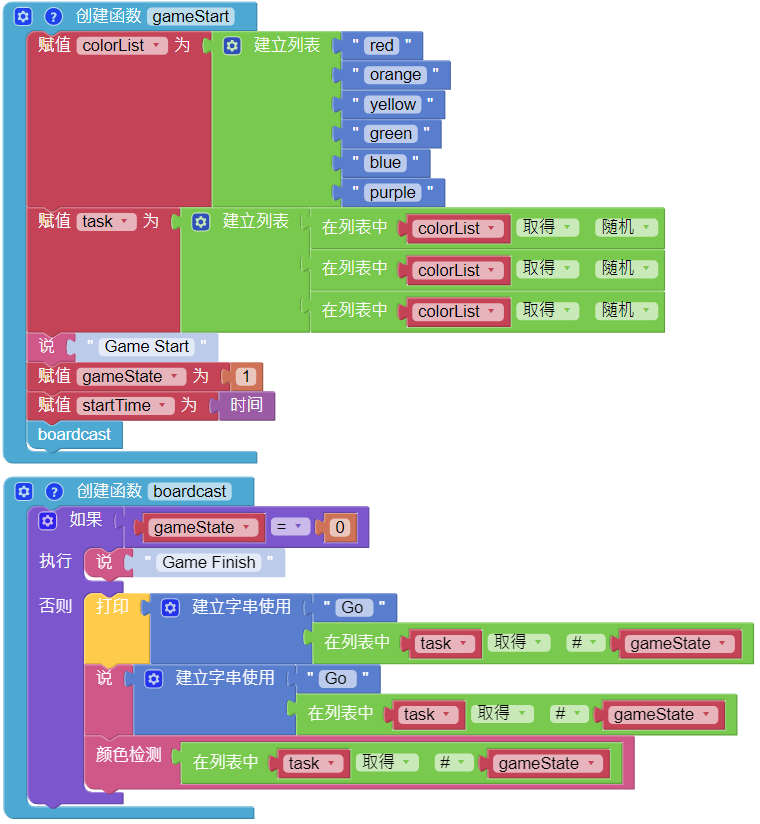

定向越野
==================

本项目使用遥控功能引导帕克进行竞技寻宝游戏！

首先，设置障碍训练场、迷宫，甚至是帕克可以通过的空房间。 然后，沿路线随机放置六个标记，并在六个标记中的每个标记处放一张色卡，供帕克查找。

帕克的六种颜色模型是：红色、橙色、黄色、绿色、蓝色和紫色，可以从下面的 PDF 中的彩色打印机进行打印。

* :download:`[PDF]颜色卡 <https://gitee.com/sunfounder/sf-pdf/raw/master/prop_card/object_detection/color-cards.pdf>`

.. image:: img/block/color_card.png

.. note::

    由于打印机碳粉或打印介质（如棕褐色纸）的不同，打印的颜色可能与 Ezblock 颜色模型的色调略有不同。 这会导致不太准确的颜色识别。

帕克将被编程为以随机顺序查找六种颜色中的三种，并将使用 TTS 功能宣布下一个要查找的颜色。

目标是帮助帕克在尽可能短的时间内找到三种颜色中的每一种。

将帕克放置在场地中间，点击遥控页面上的按钮开始游戏。

.. image:: img/block/orienteering.png

和朋友轮流玩这个游戏，看看谁能最快帮助帕克完成目标！

**示例**

.. image:: img/block/sp210513_154425.png
    :width: 800